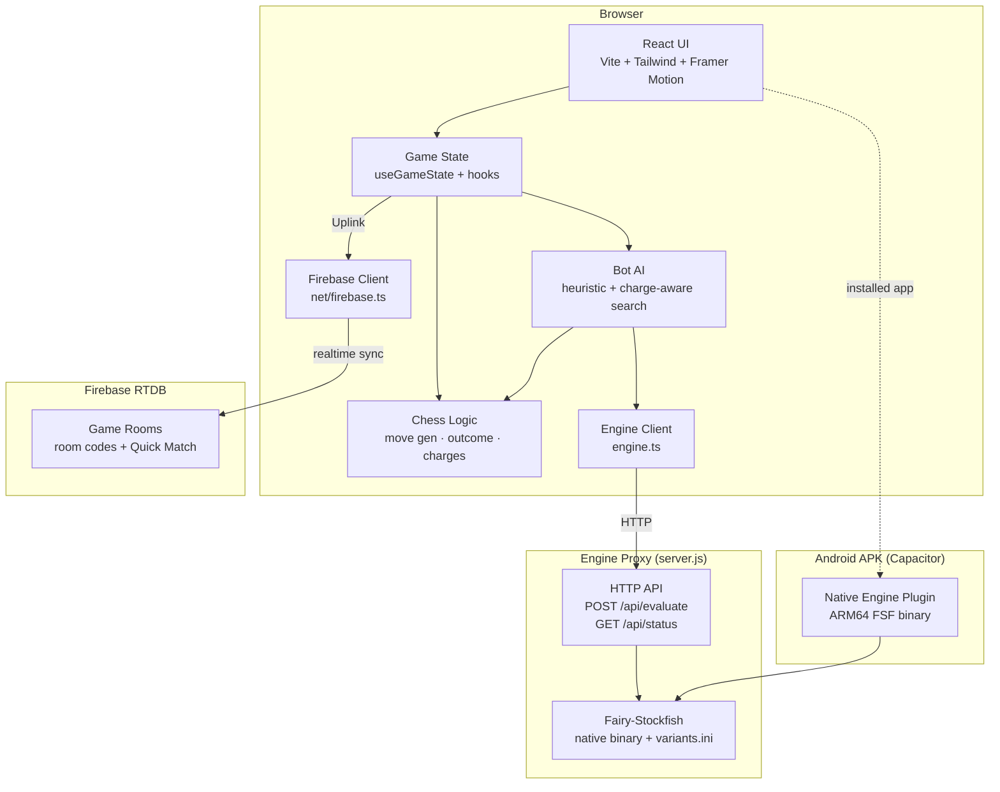
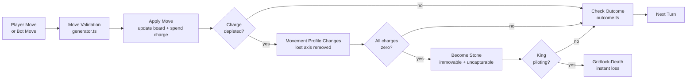
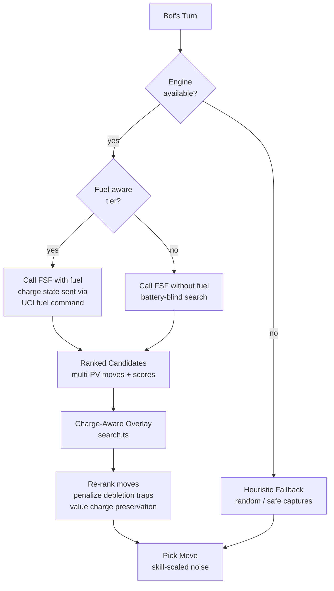
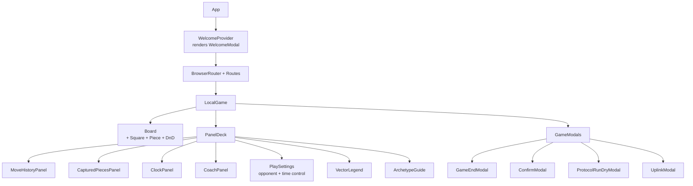
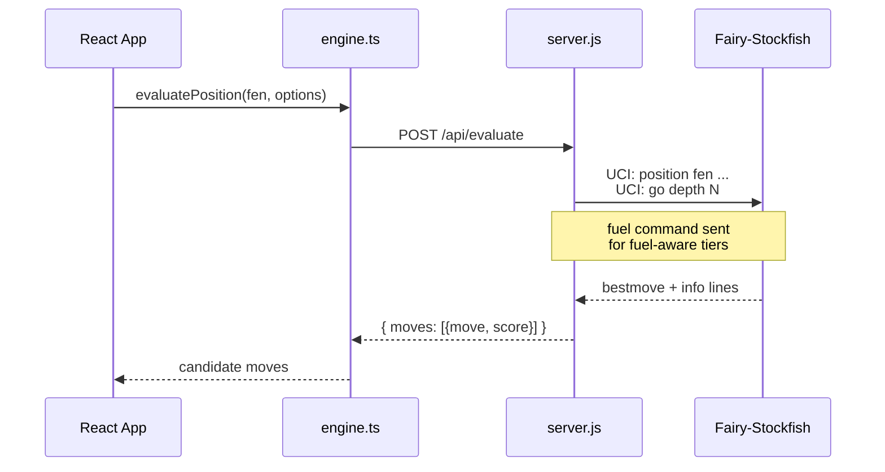
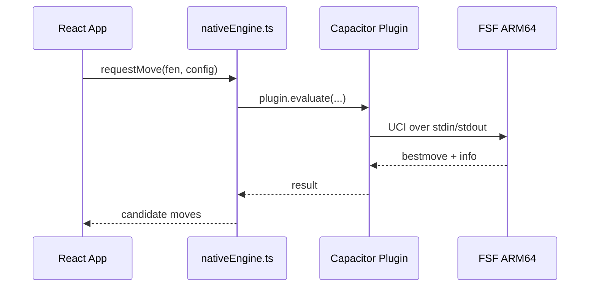
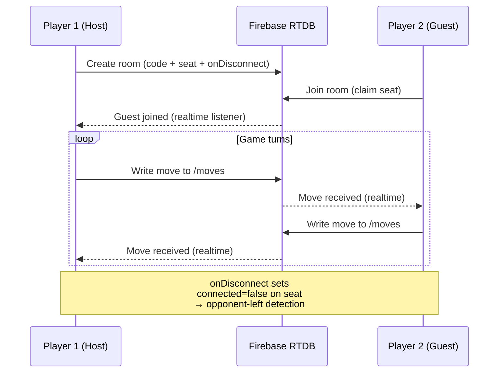

# Architecture

High-level map of Gridlock Chess. For deep dives on specific systems, see the linked docs in [`docs/dev/`](docs/dev/).

## System overview

## Game state flow

## Bot AI pipeline

The bot has two paths: a fast **heuristic fallback** (no engine needed) and the **engine path** (calls Fairy-Stockfish for deep search, then overlays charge-aware corrections).

## Component tree (game screen)

## Engine communication

### Development (Windows/Linux/macOS)

### Android APK (installed app)

## Online PvP (Uplink) protocol

## Key directories → docs/dev/ map

| Area | Source | Design doc |
|------|--------|------------|
| Bot AI + charge awareness | `src/lib/chess/bot.ts`, `search.ts` | [`BotDepletionAwareness.md`](docs/dev/BotDepletionAwareness.md) |
| Bot difficulty (25 levels) | `src/lib/chess/bot.ts` | [`BotLevelParameters.md`](docs/dev/BotLevelParameters.md) |
| Engine fuel modification | `server.js`, `variants.ini` | [`FairyStockfishFuelMod.md`](docs/dev/FairyStockfishFuelMod.md) |
| Native ARM64 build | `android/` | [`NativeEngineBuildGuide.md`](docs/dev/NativeEngineBuildGuide.md) |
| Online PvP (Firebase) | `src/lib/net/` | [`OnlineMultiplayerPlan.md`](docs/dev/OnlineMultiplayerPlan.md) |
| Piloted Anomaly (Override) | `src/lib/chess/bot.ts` | [`PilotedRoyalFix.md`](docs/dev/PilotedRoyalFix.md), [`BotOverrideAwareness.md`](docs/dev/BotOverrideAwareness.md) |
| Android packaging | `android/`, `capacitor.config.ts` | [`AppStorePackagingPlan.md`](docs/dev/AppStorePackagingPlan.md) |
| Sandbox mode | `src/lib/chess/sandbox/`, `src/components/game/sandbox/` | [`SandboxModePlan.md`](docs/dev/SandboxModePlan.md) |
| Security | — | [`SecurityChecklist.md`](docs/dev/SecurityChecklist.md) |
| Coding standards | — | [`DevStandards.md`](docs/dev/DevStandards.md) |
