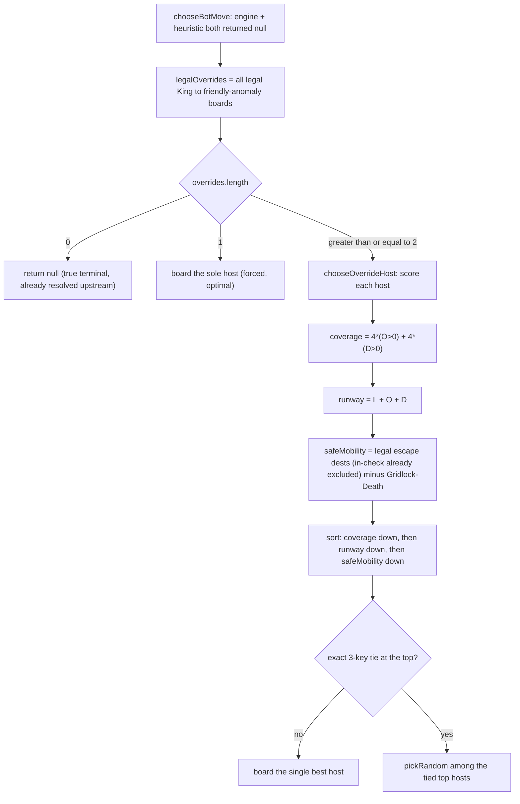

# Bot Depletion-Awareness — Consolidated Fix Log

**Status:** Bugs 1 & 2 fixed and validated. Bug 3 fixed at 1-ply (Stage 1) AND with a charge-aware multi-ply search (Stage 2), both shipped. **Bug 4 is IMPLEMENTED (✅)** — the only-Override-left **softlock** is cured by a forced-Override fallback in `chooseBotMove` (the bot boards *only* when Override is its sole legal reply). **Bug 5 is now IMPLEMENTED (✅)** — when ≥2 Overrides are legal the fallback no longer coin-flips: `chooseOverrideHost` ranks hosts by king-safety (coverage ▸ runway ▸ safeMobility). **Bug 6 is now IMPLEMENTED (✅)** — a self-piloted bot is protected on every tier: the charge-aware search is force-enabled while self-piloted, the heuristic fallback drops any self-Gridlock-Death move, and the search evaluation values a piloted royal's charge reserve. On the self-piloted engine path the search runs with `overrideMargin: 0`, so both the self-Gridlock-Death *cliff* and the *slow squeeze* toward `0/0/0` actually reach the board (the ~8 cp reserve signal would otherwise be swallowed by the default 150 cp override gate). Specs in §7 and §8 below.
**Suite at time of writing:** `tsc -b` clean · **140 tests** vitest across 18 files, all green (incl. 2 Bug 4 + 6 Bug 5 Override regressions in `bot.spec.ts`, Bug 6 search regressions in `search.spec.ts`, 2 Bug 6 **heuristic-fallback** regressions in `bot.heuristic.spec.ts` (engine mocked *off*), and 4 Bug 6 **engine-path** regressions in `bot.engine.spec.ts` (engine mocked *on*); `format.spec.ts` times out only under full-parallel load and passes in isolation) · live Fairy-Stockfish probe 6/6.
**Scope:** the Gridlock Chess bot (`src/lib/chess/bot.ts`), its charge-aware search (`src/lib/chess/search.ts`), and its interface to the native Fairy-Stockfish engine (`server.js`, `src/lib/chess/engine.ts`).

---

## 0. TL;DR

Gridlock pieces are **Anomalies** — they carry three vector charges (`L` leap, `O` orthogonal, `D` diagonal) and **spend one charge every time they move**. When a charge hits zero the piece *drops that movement type* and becomes a weaker piece. This single mechanic — **depletion** — is invisible to a classical chess engine, and it broke the bot in three distinct ways (bugs 1–3, all shipped). A *separate* trigger — giving the bot the ability to **Override under force** — surfaced a **softlock (bug 4, ✅ fixed)** and, exposed by that fix, the **host coin-flip (bug 5, ✅ fixed — boards the safest host, not a random one)** and a still-📋-proposed defect: the bot has no depletion-awareness for *playing* the **own piloted royal** it now holds (bug 6).

| # | Bug | Where the lie lived | Fix | State |
|---|-----|---------------------|-----|-------|
| 1 | Bot fed pieces to a **piloted-king** royal (suicidal / value-blind captures) | Scoring in `bot.ts` treated all captures as good | Value-aware `scoreVsPilotedKing` + widen-on-poison (Fixes 2/3/4) | ✅ Done |
| 2 | Engine **couldn't see the piloted royal's real reach** (saw a 1-square king) | FEN sent to Fairy-Stockfish flattened the royal to `k` | `gridlock-royal` variant + subset-letter FEN encoding | ✅ Done |
| 3 | Bot mis-judged **its own moves** because it ignored the charge the move spends (the "police-car fizzle") | 1-ply predicates used a non-depleting move sim | Charge-aware predicates + fizzle guard (Stage 1) **and** a charge-aware multi-ply search (Stage 2) | ✅ Done |
| 4 | Bot **cannot Override by force** — when its *only* legal move is an Override, it returns no move and the game **softlocks** (permanent hang) | `withoutOverrides` strips Override in *both* bot paths, yet the rules layer (`isCheckmate`→`getKingMoves`) counts Override as a legal escape → not checkmate → status stays `playing`; the two definitions of "legal move" disagree and the driver swallows the `null` | **Forced-Override fallback** in `chooseBotMove`: when engine+heuristic both return `null` but a legal Override exists, play one (a genuine zero-move position is already resolved to mate/stalemate upstream, so no driver change is required) | ✅ Done |
| 5 | The forced-Override fallback picked **which** friendly Anomaly to board **at random** — with ≥2 legal Overrides it could coin-flip a rich host (long charge runway) against a near-depleted one (Gridlock Death next move) | `chooseBotMove`'s fallback ended `if (overrides.length) return pickRandom(overrides)` — no host survivability scoring; `pickRandom` was uniform | **`chooseOverrideHost`**: rank legal Overrides by king-safety — **coverage** (adjacent-escape geometry: `4·(O>0)+4·(D>0)`) ▸ **runway** `L+O+D` ▸ **safeMobility** (real safe squares); `pickRandom` only to break exact ties. *Not* negamax — the search values a royal at 0 material and would board the weakest host (§7). | ✅ Done |
| 6 | Bot has **no depletion-awareness for its OWN piloted royal** — now that Bug 4 lets it board, it can spend the royal's last charge (Gridlock Death = instant loss) or fritter its charges toward `0/0/0` | Self-royal path never existed (until Bug 4 shipped the bot never boarded); `scoreVsPilotedKing` is *opponent-only* and *offensive*; the search's royal charge reserve is **unvalued** (§5) and the search is **off on easy tiers** | Symmetric **self-royal** guard: force-enable the charge-aware search whenever the bot is self-piloted + drop any self-Gridlock-Death from the heuristic fallback + add a royal charge-reserve eval term. Reuses the already-color-agnostic kernel/FEN (Bug 2). | ✅ Done |

The unifying architecture — the "s-tier" pattern that makes all of these tractable — is in [§9](#9-the-pattern-why-this-is-s-tier).

---

## 1. The mechanic that breaks everything: depletion

A standard engine models a piece as a **fixed** set of moves. A Gridlock Anomaly is a **stateful, decaying** piece:

- It holds a pool `{ L, O, D }` of charges.
- Moving along a vector spends **one** charge of that vector (`move.ts` kernel: `pool[vectorUsed] − 1`).
- At `0`, the vector is gone — the piece *literally changes type mid-game* (e.g. Amazon → Archbishop → Knight → Dead).
- The real transition is implemented once, authoritatively, in **`applyMoveToBoard` (`src/lib/chess/move.ts`)** — the only function that spends charges, recomputes gridlock, removes en-passant victims, auto-promotes to Omni, and applies Gridlock Death.

Everything below is a consequence of some code path **not** consulting that kernel and instead assuming the piece keeps its pre-move shape.

### 1.1 The vector → fairy-piece lattice (identity is emergent, and IS implemented)

**This is the mechanic that makes depletion a bug at all**, so it earns a precise statement here. An Anomaly is not a fixed piece — its **fairy identity is decided entirely by WHICH of its three vectors are still `> 0`**, never by how many charges remain. As vectors deplete to zero the piece slides "downhill" through a lattice of classical fairy pieces (it can only ever lose movement, never gain it — *batteries don't recharge*). A `balanced` Anomaly (alias **Chopper**, `4/3/3`) begins as an Amazon and degrades from there.

| L (leap) | O (orth) | D (diag) | Moves like | Fairy piece |
|:---:|:---:|:---:|---|---|
| ✅ | ✅ | ✅ | Knight + Rook + Bishop | **Amazon** |
| ✅ | ⬜ | ✅ | Knight + Bishop | **Archbishop** |
| ✅ | ✅ | ⬜ | Knight + Rook | **Chancellor** |
| ⬜ | ✅ | ✅ | Rook + Bishop | **Queen** |
| ✅ | ⬜ | ⬜ | Knight | **Knight** |
| ⬜ | ⬜ | ✅ | Bishop | **Bishop** |
| ⬜ | ✅ | ⬜ | Rook | **Rook** |
| ⬜ | ⬜ | ⬜ | — (immobile) | **Dead Piece / Stone** (Gridlocked) |

**Yes, this is implemented — verified in code, in two independent places:**

1. **The actual movement** — `getAnomalyMoves` in [movement.ts](../../src/lib/chess/movement.ts). Each vector is gated **independently** by presence: `if (v.L > 0)` adds the 8 knight leaps, `if (v.O > 0)` adds full-range orthogonal slides, `if (v.D > 0)` adds full-range diagonal slides. The union of whichever vectors are `> 0` **is** the piece's move set — so the lattice above is not a label, it is literally how the piece moves. A `0/0/0` Anomaly is `isGridlocked` and returns no moves (the Stone).
2. **The engine's view** — `pieceToFenChar` in [engine.ts](../../src/lib/chess/engine.ts) maps the same live subset to a FEN glyph: non-royal Anomalies → `m` (Amazon) / `a` (Archbishop) / `c` (Chancellor) / `q` (Queen) / `n` (Knight) / `b` (Bishop) / `r` (Rook) / dead-glyph; piloted royals → the subset-letters `e/f/g/h/i/j/s` (see §3). The engine.ts header comment states the rule verbatim: *"identity is decided by WHICH vectors are > 0, never by how many points remain."*

**Important precision (don't overstate):** the piece does **not** rewrite a stored `type`/`archetype` field when it degrades. Its `archetype` stays fixed for life (so its icon never changes — a Chopper always shows 🚁); what changes is the emergent move set (movement.ts) and the glyph shown to the engine (engine.ts). "Turns into a Queen" means *"now moves exactly like a Queen,"* not *"its type field became queen."* The stored state that actually changes is just the `vectors` pool (`move.ts`) and the derived `isGridlocked` flag.

**Why this matters for the bot (the whole reason Bugs 1–3 exist):** because identity is emergent and *decays as a side-effect of moving*, a classical engine — which assumes a piece keeps its shape — is structurally wrong about Anomalies. Fairy-Stockfish sees the current glyph but cannot model the charge that the move itself spends, so its plan reuses reach that would have depleted. Every bug in this document is a downstream consequence of this one lattice mechanic. The design rationale and full 8-state lattice (with Betza notation and a Mermaid diagram) live in [FairyCounterparts.md](./FairyCounterparts.md); the table above is the operational summary. *(Note: `FairyCounterparts.md` is still headed "Not yet implemented" — that status line is **stale**: the movement lattice and the FEN mapping are both live in the code cited above.)*

---

## 2. Bug 1 — feeding the piloted king (value-blind scoring)

### Symptom
Against a **Piloted Anomaly king** (King boarded an Anomaly via Override, so the royal now moves like an Amazon), the bot repeatedly captured into the royal — hanging pieces the royal simply recaptured.

### Root cause
The move scoring rewarded *any* capture and judged "safety" with a non-depleting simulation. A capture next to a piloted Amazon-king looked safe (the engine's shortlist didn't understand the royal could recapture) and looked profitable (a capture is a capture).

### Fix (Fixes 2/3/4 in `bot.ts`)
`scoreVsPilotedKing(board, color, m)` is **value-aware**:

- Uses `pieceCaptureValue` (pawn = 1, king = 1000, Anomaly = `L + O + D`, else 0).
- A hanging move scores `(captured − mover) × 10` — so trading a big Anomaly for nothing is deeply negative.
- A *safe* capture / check is rewarded (`captured × 10 + 1000` check bonus); mate = `1_000_000`.
- **Widen-on-poison:** if *every* engine candidate scores negative (the shortlist is poisoned because the engine misjudged the royal), the bot re-scans the **entire legal move set** and takes the safest move instead of the least-bad sacrifice.

The heuristic fallback (`heuristicMove`) mirrors this: it prefers `safeCaptures → winningCaptures → safeChecks → safe`, and will only take an unsafe capture if it *wins material*.

**Tests:** `bot.spec.ts` — 4 suicidal-check + 2 value-aware cases.

---

## 3. Bug 2 — the engine couldn't see the royal (piloted-royal encoding)

### Symptom
Even with correct scoring, the engine's *suggestions* were built on a false board: a Piloted Anomaly king was serialized to FEN as a plain 1-square king `k`. The engine planned as if the royal were a helpless monarch when it was actually an Amazon.

### Why FEN was the bottleneck
Fairy-Stockfish plans on the FEN we hand it. If the FEN lies about a piece's reach, the engine's entire search is built on fiction — no amount of TS-side scoring fully compensates, because the *candidate list itself* is wrong.

### Fix — a purpose-built variant + subset-letter encoding
1. **`gridlock-royal` variant** (`variants.ini`): custom Betza pieces `customPiece1..7 = e:QN, f:BN, g:RN, h:Q, i:N, j:B, s:R`, with `extinctionPseudoRoyal = true` and `extinctionPieceTypes = kefghijs`. This makes the lettered pieces behave as royals whose extinction = loss — the closest faithful model of a piloted royal FSF can express.
2. **Subset-letter FEN** (`pieceToFenChar` in `engine.ts`): a piloted royal is emitted as the letter matching its **surviving vectors** —
   `O&D&L → e` (royal Amazon), `D&L → f` (royal Archbishop), `O&L → g`, `O&D → h`, `L → i` (royal Knight), `D → j`, `O → s`, `0/0/0 → DEAD_GLYPH`.
   Non-royal Anomalies map to `m/a/c/q/n/b/r`.
3. **`server.js`** loads the variant (`VARIANT_NAME = 'gridlock-royal'`, `setoption name VariantPath` + `UCI_Variant`).

**Validation:** 6/6 behaviors proven (royal Amazon diagonal capture, rook-`s` has no diagonal, royal is in-check / can recapture the checker, no parse errors). **Tests:** 8 FEN subset-letter cases in `engine.spec.ts`.

### Honest limit
FSF **still cannot model depletion.** It has no per-piece charge counter and no "the-vector-you-just-used hit 0" trigger. The subset-letter FEN is a *snapshot* of the royal's shape at the current instant — correct for ply 1, fiction thereafter (the engine will happily plan a 12-ply line reusing a vector that would have depleted on move 2). This is the exact seam Bug 3 lives in, and the reason Stage 2 is the only real cure for deep play.

---

## 4. Bug 3 — the bot ignored the charge *its own move* spends (the police-car fizzle)

### The concrete failure the user described
A non-royal "police car" Anomaly at `b1` with `O:1 / D:2 / L:5` slides **orthogonally** up the file `b1→b5` to "check" the black king on `b8`. But sliding orthogonally spends its **last** `O` charge, so the instant it lands it is `O:0 / D:2 / L:5` — it has **no orthogonal reach**, and the check never existed. The bot valued a check that evaporates on arrival.

### Root cause
The bot's 1-ply predicates judged moves on a **non-depleting** simulation (`applyMove` from `check.ts`, whose own comment says "Vector consumption is handled in game state, not here"). So `givesCheck` / `isSafe` / `scoreVsPilotedKing` all saw the piece with its **pre-move** shape — the police car still had its `O` charge in the simulation, so the file attack looked real.

Two independent lies stack here:
1. **The 1-ply lie** — the *current* move is misjudged (fixed by Stage 1).
2. **The deep-tree lie** — Fairy-Stockfish's search past ply 1 reuses charges that would have depleted, so *deeper search is more wrong, not less*. For an Anomaly, only **h = 1 ply** is trustworthy (fixed only by Stage 2).

### Stage 1 fix (shipped) — judge every 1-ply move on the REAL board
A single helper routes all 1-ply judgments through the authoritative kernel:

```ts
// bot.ts
const applyReal = (board, color, m, enPassantTarget?): Board => {
  const res = applyMoveToBoard(board, m.from, m.to, color, enPassantTarget ?? null);
  return res.valid ? res.board : applyMove(board, m.from, m.to); // fallback keeps it total
};
```

- `givesCheck`, `isSafe`, and `scoreVsPilotedKing` now evaluate on `applyReal(...)` — i.e. the piece **as it actually becomes** after spending its charge. The police-car check is now correctly seen as *no check*.
- `givesCheck` is exported for regression testing.

**Conservative fizzle guard** (non-piloted branch of `getEngineMove`): the engine may still *hand us* a fizzled check as its top candidate (it planned on the pre-move shape). The guard acts **only** on that one proven, depletion-specific defect:

```ts
// If the engine's top pick checks on the stale board but NOT on the real depleted board,
// prefer the highest-ranked candidate that genuinely checks on the real board.
// If none exists, keep the engine's pick — never override without a strictly-better swap.
```

### Why the guard is deliberately narrow (and what it does NOT do)
- It handles a **fizzled check** only. That is the case the engine *cannot* see (the mover's own reach changed) and where a strictly-better replacement is well-defined.
- It does **not** veto a move that merely hangs the mover. Enemy attackers on the landing square are *real regardless of the mover's depletion* — the engine already sees them, so a "hang" in its top move is likely an intentional sacrifice. Vetoing it would make normal play weaker.
- Broader fizzles (a fork / pin / defense that depends on the mover's post-move shape) are **not** covered — they need real lookahead and belong to Stage 2.

**Tests:** `bot.spec.ts` — 3 police-car cases: `O:1` fizzles (`givesCheck → false`), `O:2` survives (`givesCheck → true`), plus a documentation anchor showing the pre-move shape is what the old code was fooled by.

### Honest limit of Stage 1
Stage 1 fixes **only the current move (1 ply).** The engine's *deep* line is still fiction for any Anomaly. Stage 1 stops the bot from *playing* an obviously self-defeating move; it does not make the bot *plan* correctly. That is what Stage 2 adds.

---

## 5. Stage 2 — charge-aware search (`src/lib/chess/search.ts`) — SHIPPED

**Goal:** replace the fictional deep tree with a shallow-but-*true* search that steps through `applyMoveToBoard` at every node, so depletion, type-changes, gridlock and Gridlock Death are all exact.

### What was built
- **Negamax + alpha-beta + iterative deepening** (`searchBestMove`), deterministic (no RNG), time-boxed by an optional `timeBudgetMs`.
- **Quiescence search** over forcing captures so leaves aren't evaluated mid-trade; under check it searches every evasion instead of standing pat (soundness).
- **Kernel per node:** every child position comes from `applyMoveToBoard` — the *same* law the UI uses — so the search can never diverge from real rules. Two terminal shortcuts are centralized in `terminalChildScore`: a move that triggers the mover's **Gridlock Death** is an instant loss; a move that **captures the enemy royal** (`findKing` returns null) is an instant win.
- **Charge-aware evaluation:** material scales with a piece's *surviving* charges (`ANOMALY_BASE + CHARGE_VALUE × charges`; a 0-charge Anomaly is a dead blocker worth 0; royals are 0 and handled by terminals), plus a light in-check term. Deliberately simple — it exists to find concrete tactics the engine can't see, not to be a positional oracle.
- **Move ordering:** MVV-LVA (by charge-aware worth) + a history-heuristic table + principal-variation-first at the root, to make alpha-beta actually cut.
- **Overrides excluded** from the tree for both sides, matching the bot's standing "never board" policy.

### How it's integrated (non-destructive)
`preferSearchMove(board, color, ep, enginePick, opts)` runs the search and swaps in its move **only** when that move beats the engine's pick by ≥ `OVERRIDE_MARGIN` (≈ 1.5 pawns) under the true rules — otherwise the engine's (positionally stronger) choice stands. It runs **after** the native engine, on the non-piloted branch of `getEngineMove`, and is **off** (`maxDepth: 0`) for the easy tiers so the ELO ladder and intended beatability are preserved. Budgets ramp `skilled` (depth 3) → `asi` (depth 8) in `SEARCH_BUDGET`.

This is the same "engine as advisor, TS rules as law" pattern, now extended from 1 ply to a real search: the engine proposes and orders, the charge-aware search vetoes a proposal only when it can *prove* (by stepping through the real kernel) a materially better move exists.

### Perf / honest limits (measured, not aspirational)
- **This search is slow, and slower than first claimed.** Concrete data point: a single position with one high-mobility Anomaly (`{L:3,O:4,D:3}`, ~30 legal moves) at **maxDepth 3** costs **~1s isolated** and **>5s under parallel CPU load** — enough to trip a test timeout (see audit below). The earlier "~6-8 ply realistic" figure was optimistic and unmeasured; treat the `SEARCH_BUDGET` `maxDepth` values (3→8) as *ceilings*, not typical reach.
- **In production the time budget, not `maxDepth`, sets effective depth.** Every strong tier pairs `maxDepth` with a `timeBudgetMs` (e.g. `grandmaster { maxDepth: 6, timeBudgetMs: 1500 }`). On a complex Anomaly position, 1.5s will usually complete only depth ~3-4 via iterative deepening; the deeper `maxDepth` is a cap that is rarely reached. This is acceptable (the budget guarantees the bot still moves promptly) but means the search's practical strength is modest — it is a *tactical safety net over the engine*, not a deep planner.
- **Cost drivers (unoptimized):** branching is dominated by slides (O/D vectors give full-board rays, ~11 squares each; L gives ≤8). `getAllLegalMoves` is expensive (per candidate it runs `wouldBeInCheck` = an `applyMove` + full-board `isInCheck` scan), and `captureMoves` regenerates the full legal set then filters, so quiescence double-generates. No transposition table, no move-gen caching. These are the obvious optimization targets if depth needs to rise.
- The evaluation is intentionally thin (material-by-charges + check). King-safety zones, pawn structure, and piece-square tables are **not** modeled — those are the next tuning frontier if empirical play shows positional drift.
- **Not yet playtested against humans.** Correctness is proven by the invariant suite (`search.spec.ts`): finds a free material capture, never suicides its own royal into Gridlock Death, never Overrides, is deterministic, and `preferSearchMove` overrides an engine blunder / keeps a good engine pick / stays disabled at depth 0. Whether it *plays* better end-to-end is **unmeasured**.
- The **opponent-only-piloted branch** still ranks moves with the dedicated Stage-1 `scoreVsPilotedKing` logic, not the search (kept focused to limit regression risk). Note the *candidates* it ranks are still full-depth Fairy-Stockfish output — only the re-ranking metric is 1-ply. What the deferral gives up is not depth-of-candidates but the **one tool that understands enemy-royal depletion**: because FSF is depletion-blind and `scoreVsPilotedKing` is 1-ply, nothing in this branch can *plan a multi-move Gridlock-Death squeeze* on the opponent's royal. (The both-piloted case already routes through `preferSearchMove` — see §7.) Extending the search to this branch is a clean future step.

### Known modeling inaccuracies (audited, accepted)
These are real and stated plainly rather than hidden:
- **Override-as-false-mate (optimistic).** `getKingMoves` emits Override (King boarding a friendly Anomaly) as a legal escape, but the search *strips Overrides for both sides*. So if the opponent's ONLY escape from check is to board a friendly Anomaly, the search scores the position as checkmate (a win) when the human could actually survive. Rare, but it biases the bot toward "mates" that aren't. This matches the bot's own never-board policy for its side, but underestimates the opponent's resources.
- **Legal-move generation is non-depleting.** `getAllLegalMoves` decides king-safety via the non-depleting `applyMove` (check.ts), then the search re-applies each move with the real depleting kernel. In the rare case where the moved piece's *post-depletion shape* changes whether it shields its own king, the legal-move set can be slightly off. This is a pre-existing approximation the search inherits, not one it introduces.
- **Royal charge reserve is now valued (Bug 6 Stage B, ✅).** A piloted royal is worth 0 *material* (its death is a terminal), so the base eval was blind to a *slow* squeeze of its charges toward `0/0/0`. The search evaluation now adds a light per-charge reserve term (`ROYAL_RESERVE_VALUE = 8`, far below `CHARGE_VALUE = 55`) for a piloted royal on either side, so it prefers conserving its own royal's charges and draining the enemy's — without distorting material trades. Until Bug 4 shipped this seam never affected the bot's own play (it never boarded); it went live the moment the forced-Override fallback could board the bot, and Bug 6 closes it.
- **Quiescence is depth-capped** at `QUIESCE_CHECK_EXTENSION_CAP = 12`: a perpetual/repeated-check line returns a static eval at the cap instead of recursing forever. This is a bounded approximation added specifically to prevent stack overflow (see fixes below). Note this caps the *forcing-move extension beyond* the main search — it is unrelated to `SearchOptions.maxDepth` (≤ 8) or the native engine's `DIFFICULTY_CONFIG.depth` (up to 24).
- **Determinism holds only without a time budget.** The search uses no RNG, so at a fixed `maxDepth` (no `timeBudgetMs`) it is fully deterministic (tested). With a wall-clock budget, `Date.now()` cutoffs make the completed depth — and thus the move — machine/load-dependent.

### Post-implementation audit — defects found and fixed
Audits after the first implementation surfaced three real defects, all now fixed and re-validated (111/111, confirmed stable across repeated full parallel runs):
1. **Unbounded quiescence recursion.** The original `quiesce` had no depth cap; a check-evasion chain never reduces material, so a perpetual-check line would recurse until stack overflow (guaranteed with no time budget, e.g. in tests). Fixed with `QUIESCE_CHECK_EXTENSION_CAP`.
2. **Depth-mismatched override comparison.** `preferSearchMove` compared the search's best (from iterative deepening, which may stop *below* `maxDepth` under time pressure) against the engine pick scored at the *full* `maxDepth` — an apples-to-oranges comparison that could cause spurious overrides/non-overrides. Fixed by scoring the engine pick at the search's actually-completed depth (`res.depth`).
3. **Flaky search tests under load (perf, not logic).** The `search.spec.ts` invariant tests run the search with **no time budget** (required for determinism), so they depend on raw speed. Under parallel CPU load one test (`{L:3,O:4,D:3}` anomaly at depth 3) exceeded vitest's default **5s** timeout and failed — while passing in isolation. Fixed by (a) reducing that test's Anomaly to a low-mobility leaper (its vectors are irrelevant to the Override invariant), (b) lowering the determinism test from depth 4 to 3, and (c) adding an explicit **30s** timeout to each CPU-heavy search test (other suites keep the strict 5s default so genuine regressions still surface). This flakiness is itself evidence of the perf limits noted above.

---

## 6. Bug 4 — the bot cannot Override by force (the only-Override-left softlock) (✅ IMPLEMENTED)

> **Status:** **fixed and validated.** Was the first *specified-but-not-built* entry in this log; now shipped as a forced-Override fallback in `chooseBotMove` (see "Fix" below), with two regression tests in `bot.spec.ts`. It is the **trigger** for both Bug 5 (which host to board — §7) and Bug 6 (how to play the royal afterwards — §8): shipping it makes both live. This was a **live** defect — reproducible before the fix — rare only because a human had to deliberately trap the bot's King so that Override became its *sole* legal reply.

### Symptom (observed, reproduced from a real replay)
A human trapped the bot's King (`b8`) so that its **only** legal move was an Override onto an adjacent friendly Anomaly. The game then **hung forever**: the "thinking" indicator vanished but no move was ever made and it never became the human's turn again — a permanent softlock, not a loss, draw, or checkmate.

### Root cause — two conflicting definitions of "legal move"
The rules layer and the bot layer disagree about whether Override counts as a move, and the disagreement is invisible until Override is the *only* option:
1. **Rules layer counts Override as a legal escape.** `getAllLegalMoves` → `getKingMoves` ([check.ts](../../src/lib/chess/check.ts), [movement.ts](../../src/lib/chess/movement.ts)) emits the Override target, so `isCheckmate` returns **false** in the trapped position (the King "can escape" by boarding) and `evaluateOutcome` keeps `status: 'playing'` — the game believes play continues.
2. **Bot layer forbids Override in both paths.** `withoutOverrides` strips every Override before selection in *both* `getEngineMove` and `heuristicMove` ([bot.ts](../../src/lib/chess/bot.ts)). When Override is the only legal move, both pools are empty, so `chooseBotMove` returns **`null`**.
3. **The driver silently swallows the `null`.** The bot effect in [LocalGame.tsx](../../src/components/game/LocalGame.tsx) races the move against a minimum think-delay: `Promise.all([ chooseBotMove(...), minDelayPromise ]).then(([move]) => { if (cancelled || !move) return; makeMove(move.from, move.to); })`. (The `[move]` destructuring is the `Promise.all` tuple, **not** `chooseBotMove`'s return — that resolves to a single `BotMove | null`.) On `null` it returns early, the `.finally` clears `botThinking` and the `botMoveInFlight` ref, and **no game state changes** — so the effect's deps (`[turn, status, opponentMode, board, activeBotDifficulty]`) never change and it never re-fires. Permanent deadlock.

Net: the game says *"still playing, bot to move,"* the bot says *"I have no move,"* and nothing reconciles the two.

### Evidence (observed in-session; not currently reproducible)
Replaying the reported game to the trapped position and enumerating with the real rules kernel yielded: **Black to move · `IN_CHECK: true` · `IS_CHECKMATE: false` · `TOTAL_LEGAL: 1` = `[{ b8→c8, override: true }]` · `NON_OVERRIDE_LEGAL: 0` · `KING_AT: b8`.** One legal move, it was an Override, the bot's filter removes it → `null` → hang. **Caveat:** this was produced by a throwaway replay test that has **since been deleted**, so the exact squares/counts above are reported from that earlier run, not from a test that can be re-executed today. The *causal chain* (below) is re-verified against current source; the specific `b8→c8` figures are not.

### Fix (implemented) — forced-Override fallback (Option A)
`chooseBotMove` now has a last-resort branch that fires **only** when engine *and* heuristic both return `null` (shipped in [bot.ts](../../src/lib/chess/bot.ts) via the new `legalOverrides` helper — the inverse of `withoutOverrides`):
- Recompute `getAllLegalMoves(board, color, ep)` **without** `withoutOverrides` and collect the legal Overrides.
- If any exist, play one. Every Override in `getAllLegalMoves` is *already* check-safe by construction (it passed the `wouldBeInCheck` filter), so no extra check-safety pass is needed — **caveat:** that filter judges safety on `check.ts`'s **non-depleting** `applyMove`, which relocates the king but does **not** model the piloted royal's real reach, so "safe" here is the same 1-square-king approximation the rest of the sim uses. **When *more than one* Override is legal (Bug 5, §7, ✅ now fixed):** the fallback calls `chooseOverrideHost`, which boards the safest host (coverage ▸ runway ▸ safeMobility) rather than a random one.
- If there are genuinely **zero** legal moves of any kind, return `null`. **This branch is already handled correctly today** and needs no new driver code: a true no-legal-move position was resolved to `checkmate`/`stalemate` by `evaluateOutcome` on the *human's prior ply*, so the bot effect's `if (status !== 'playing') return;` guard means it never fires there. A defensive `else` in the driver that resolves the outcome is therefore **redundant belt-and-suspenders**, not a correctness requirement — the *only* live softlock trigger is "only Overrides remain" (status still `playing`), which the `bot.ts` fallback alone cures.

**Why this is weakly dominant, not a gamble:** the counterfactual to a forced Override is *"the bot cannot move at all"* — a hung game. Any legal move, even boarding into a near-lost royal endgame, strictly beats a softlock. No valuation is required to justify it — that is why it is a *forced* fallback, not the *scored* Override feature of [BotOverrideAwareness.md](./BotOverrideAwareness.md) §5. The boarding ply itself can never self-lose (`getKingMoves` offers only non-gridlocked hosts; `move.ts` returns `gridlockDeath: false` for the Override branch).

### Coupling to Bugs 5 & 6 (Bug 4 shipped first)
The instant this fix lets the bot board, two gaps went live: **which** host it boards (**Bug 5**, §7) and how it plays the royal afterwards (**Bug 6**, §8). These were always **staged**, not shipped as a literal set: Bug 4 lands first because a softlock is strictly worse than a degraded-but-legal continuation. **Bugs 4, 5, and 6 are all now shipped.** A forced-boarded bot boards the *safest* host (Bug 5) and then plays that royal with depletion awareness — never volunteering a self-Gridlock-Death and conserving its charges (Bug 6) — while the boarding ply itself is always safe (see below).

### Tests (added)
- **Softlock cure:** `bot.spec.ts` constructs a black King double-checked in the corner (a8) whose *only* legal move is boarding a friendly Anomaly on b8, and asserts `chooseBotMove` returns `{ from: 'a8', to: 'b8' }` — **not** `null`. (This is a freshly-built permanent regression; it does **not** rely on the deleted in-session replay figures.)
- **No-regression:** in a position with normal legal moves plus an available Override, the fallback stays inert — `chooseBotMove` returns a non-Override move (never `a8→b8`).

### Honest limits
- **Rare trigger, severe effect.** It needs a deliberate trap, but when it happens the game is *unplayable* (hard hang) — severity outranks frequency.
- **Forced-Override positions are near-lost** (one legal move, in check) — the fix turns a *hang* into a *likely loss played out legally*, which is the correct outcome, not a rescue.

---

## 7. Bug 5 — the forced-Override host choice was uniformly random (no host intelligence) (✅ IMPLEMENTED)

> **Status:** **fixed and validated.** Rode directly on Bug 4: the forced-Override fallback un-hangs the game, but when **more than one** friendly Anomaly was boardable it picked **at random**. Now `chooseBotMove`'s fallback calls `chooseOverrideHost`, which ranks legal Overrides by king-safety (**coverage ▸ runway ▸ safeMobility**) and boards the safest host; only an exact three-way tie falls back to `pickRandom`. Two regression tests in `bot.spec.ts`. Rare (needs the King adjacent to ≥2 boardable Anomalies with ≥2 check-escaping boards that differ in survivability) but, when it hit, it could coin-flip a salvageable position into an immediate loss. Distinct from Bug 6: this is about **which host to board**; Bug 6 is about **how to play the royal after boarding**.

### Symptom
With ≥2 legal Overrides, the bot boards an arbitrary one. If one host is a rich Anomaly (say Amazon `4/3/3`, runway `C = 10`) and another is near-depleted (say Knight `1/0/0`, runway `C = 1`), the bot has a 50% chance of boarding the `1/0/0` host — whose **very next move spends its last charge → `gridlockDeath` → instant loss**. The two outcomes (playable royal endgame vs lose-in-one) are decided by `Math.random()`.

### Root cause (code-verified, pre-fix)
Before the fix the fallback in [bot.ts](../../src/lib/chess/bot.ts) `chooseBotMove` ended:
```ts
const overrides = legalOverrides(board, getAllLegalMoves(board, color, enPassantTarget));
if (overrides.length) return pickRandom(overrides);
```
`legalOverrides` collects **every** legal King→friendly-anomaly board; `pickRandom` (`arr[Math.floor(Math.random() * arr.length)]`) selected **uniformly**. There was **zero** evaluation of which host is better — neither the native engine nor the charge-aware search is consulted (the fallback only runs *after* both returned `null`).

### Why the host choice matters (mathematical validation)
Boarding host `H` makes the King a Piloted Anomaly that **inherits H's vectors** as its royal mobility (movement.ts lattice). So the host sets: (a) the royal's fairy identity, (b) its total charge runway `C = L + O + D`, and (c) its distance to `0/0/0` = **Gridlock Death**.

| Host | Vectors | Identity | Runway `C` | Death clock |
|---|---|---|---|---|
| A | 4/3/3 | Amazon | 10 | ≥10 moves |
| B | 1/0/0 | Knight | 1 | **1 move** |

Under `pickRandom`, `P(A) = P(B) = 0.5`. Boarding A → a mobile royal with a long runway; boarding B → a royal that dies on its next move. The expected outcome is split by a coin toss the code makes blind. (Boarding *itself* is never the death — `move.ts` returns `gridlockDeath: false` for the Override branch and `getKingMoves` only offers non-gridlocked hosts — so the lever is the host's *runway*, not boarding legality.)

### Edge-case audit (be skeptical)
- **Exactly one legal Override** (the common trapped-King case): `pickRandom` of a 1-element array is deterministic and already optimal — **no defect**. This is why Bug 4's tests pass and why the softlock cure is unaffected.
- **≥2 rich hosts of similar runway:** choice barely matters; random is ~fine.
- **≥2 hosts, one rich + one near-depleted:** random is **actively harmful** — the only case that truly bites, but its cost is maximal (throwing a salvageable position).
- **Check-safety is not a differentiator:** every candidate already passed `wouldBeInCheck`, so no candidate hangs the royal to immediate recapture (modulo the known non-depleting 1-square-king approximation). The true differentiators among the safe candidates are **adjacent-escape coverage**, **charge runway**, and **real safe-mobility** — all ignored by `pickRandom`, all now scored by `chooseOverrideHost` (below).

### Fix (implemented) — host-scoring by king-safety, and why NOT negamax
`chooseOverrideHost(board, color, enPassantTarget, overrides)` replaces `pickRandom(overrides)` in the fallback. A single host is boarded outright; otherwise hosts are ranked **lexicographically** by three depletion-aware king-safety keys, with `pickRandom` used **only** for an exact three-way tie:

1. **coverage** `= 4·(O>0) + 4·(D>0)` — **adjacent-escape geometry from the fairy lattice** (§1.1). A piloted royal escapes a check only along a vector it still owns: `O` covers the 4 orthogonal adjacent squares, `D` the 4 diagonal ones, and `L` (knight) covers **zero** adjacent squares. So a Knight-royal (`coverage 0`) is structurally the most mate-prone host — the **dominant** survival signal. Read straight from `board[to].vectors` (the boarded royal keeps the host's vectors unchanged — `move.ts` spreads `...host`).
2. **runway** `= L + O + D` — moves before the royal is squeezed toward `0/0/0` Gridlock Death. Secondary.
3. **safeMobility** — count of the piloted royal's **non-suicidal legal escape squares** on this board: its legal destinations (from `getAllLegalMoves`, which already excludes any square that leaves the royal in check) minus those that self-Gridlock-Death, the death flag read by replaying each through the real depleting kernel (Bug 3). Board-specific final tiebreak. *No separate "still attacked?" pass is needed:* `getAllLegalMoves`'s own `wouldBeInCheck` filter recognises the piloted royal (via `findKing`) and already drops attacked destinations — and since an opponent's reach to a square is independent of the royal's **own** vector pool, the depleting board and the non-depleting board `getAllLegalMoves` uses agree exactly on which destinations are attacked, so a second `isSquareAttacked` pass could never reject anything the filter kept.

**Why coverage-primary, not runway-primary (refinement of the original proposal):** runway alone mis-ranks a `Knight 5/0/0` (runway 5, coverage 0) **above** a `Queen 0/2/2` (runway 4, coverage 8), yet the Queen-royal is far safer — it can sidestep a check in all 8 directions while the Knight can step to no adjacent square at all. Adjacent-escape coverage is the sharper king-safety signal; runway then longevity-breaks ties among equally-covered hosts (e.g. `Queen 0/8/8` over `Amazon 1/1/1`, both coverage 8).

**Why NOT rank hosts with the charge-aware negamax** (the tempting "use the search" approach — rejected after analysis): `search.ts` scores a piloted royal at **0 material** (`pieceWorth` / `isRoyal`). Between two boarded boards its quiet-line evaluation therefore prefers whichever **keeps the richer Anomaly as a non-royal fighter** — i.e. it would systematically board the **weakest** host to bank the strongest as material, the exact **inverse** of royal survival. The bias magnitude is ≈ `CHARGE_VALUE·ΔC` (≈ 495cp for a 10-vs-1 charge gap), dwarfing the eval's tiny king-safety term. Only the search's **terminal** terms (mate / Gridlock Death, ±`MATE`) are trustworthy; its quiet-line material signal is corrupted for *this* decision. So host selection uses the uncorrupted king-safety keys above instead. (Playing the royal well *after* boarding — where the terminal-safe search is the right tool — is Bug 6.)

This adds no new movement/FEN code and reuses the vector pool the kernel already tracks. The full decision flow:



### Tests (shipped, `bot.spec.ts` → "chooseBotMove — forced-Override host selection (Bug 5)")
Both tests trap the black King at `a5` in **double check** (white Rook `a1` on the a-file + Bishop `e1` on the `e1–a5` diagonal) so boarding is the King's ONLY legal reply and neither host can interpose (a double check can't be blocked), leaving exactly the two Overrides `a5→b5` / `a5→b6` for the fallback:
- **Coverage differentiator:** `b5` = Amazon-shaped `4/3/3` (coverage 8) vs `b6` = Knight-shaped `5/0/0` (coverage 0) → asserts the bot boards `b5`.
- **Runway tiebreak:** `b5` = `1/1/1` and `b6` = `9/9/9` (both coverage 8) → asserts the bot boards `b6` (longer runway).
- **Single-Override no-regression:** the existing Bug 4 softlock test (one legal Override) still boards that sole host — `chooseOverrideHost` short-circuits `length === 1`.

**Direct unit tests of the exported helpers** (`chooseOverrideHost` / `hostSurvivability`, exported alongside `scoreVsPilotedKing` / `givesCheck`) exercise the two keys the board-traps above never reach:
- **safeMobility tiebreak** ("chooseOverrideHost — safeMobility tiebreak"): two balanced `3/3/3` hosts on `b2` (open) vs `a1` (cornered) tie on coverage (8) and runway (9); the cornered host's every slide/diagonal is throttled by the corner and the `b2` blocker, so `safeMobility` strictly favours the open host — asserts both the count inequality via `hostSurvivability` and that `chooseOverrideHost` boards `b2`.
- **Exact three-key tie → random** ("chooseOverrideHost — exact three-key tie"): two **knight-only** hosts (`L:3,O:0,D:0`) on `a3`/`c1`, each with exactly 4 knight moves (knights don't slide, so no far-board asymmetry leaks in), tie on ALL three keys (`toEqual`); a `Math.random` spy then proves both tied hosts are reachable (index 0 → first, ~1 → second).

### Honest limits
- **Rare trigger.** Needs ≥2 boardable hosts differing in survivability while the King is trapped — rarer than the softlock itself. When only one Override exists (the usual case), there is nothing to choose and no bug.
- **Near-lost anyway.** Like Bug 4, the position is typically near-lost; picking the better host mostly buys a longer, more dignified defence — occasionally a draw — not usually a win.
- **Host selection ≠ royal play.** Coverage/runway/safeMobility choose the *safest host*; they do **not** look ahead for a forced mate (neither did the pre-fix code). Playing the boarded royal well over subsequent plies is Bug 6's job.
- **The misleading Bug 4 note is corrected:** the earlier phrasing "prefer an Override that is not a self-Gridlock-Death" was inaccurate — boarding is *never* a self-Gridlock-Death; the real criterion is host **king-safety** (adjacent-escape coverage first, then runway), captured here.

---

## 8. Bug 6 — the bot has no depletion-awareness for its OWN piloted royal (✅ IMPLEMENTED)

> **Status:** **fixed and validated.** With **Bug 4** (the forced-Override fallback) shipped, the bot can be forced to board and hold a piloted royal; **Bug 5** now boards the safest host; and **Bug 6** makes it *play* that royal with depletion awareness. The bot still **never boards voluntarily** (`withoutOverrides` strips Override in both selection paths and the search excludes it for both sides). The Bug 6 fix is guarded by regressions in `search.spec.ts` (search-level royal-death refusal + charge conservation), `bot.heuristic.spec.ts` (heuristic-fallback guard, engine mocked off), and `bot.engine.spec.ts` (the real engine→`preferSearchMove` path, engine mocked on). The fix is defensive and lives in the search + heuristic fallback + eval, never in an attack scorer.

### Symptom (now reachable via Bug 4)
The moment the bot is forced to Override, its King boards a friendly Anomaly and becomes a **Piloted Anomaly royal** (moves like an Amazon/Queen/etc. for its surviving vectors). From that ply on, the bot's single most important piece is steered mainly by a **depletion-blind engine**, with **no self-side depletion correction on the easy tiers**. Concretely it can:
- **Gridlock-Death itself** — spend the royal's last charge, which `move.ts` scores as `gridlockDeath` → instant loss; and/or
- **fritter the royal's charges** toward `0/0/0`, walking into a slow death it never had to.

### Root cause (three parts, all code-verified)
1. **Engine depletion-blindness is symmetric.** Bug 2's honest limit (§3) applies to *both* colors: `pieceToFenChar` ([engine.ts](../../src/lib/chess/engine.ts)) already emits the royal's **correct current shape** for either side (color-agnostic subset-letter FEN — so *reach* is fine), but Fairy-Stockfish still cannot model the charge each move spends, so it will happily steer the bot's own royal toward the cliff.
2. **The only dedicated royal corrector is opponent-only AND offensive.** `getEngineMove` runs `scoreVsPilotedKing` solely under `hasPilotedKing(board, opponentOf(color))` ([bot.ts](../../src/lib/chess/bot.ts)). That evaluator scores how to **attack an enemy** piloted royal (land sticking checks, don't feed material into it). There is **no `hasPilotedKing(board, color)` self-branch**, and even if mirrored it would be the *wrong tool* — the bot's own royal needs a **defensive depletion** evaluator, not an attack scorer.
3. **Stage-2 search covers it only partially, and NOT AT ALL when the human is also piloted.** When the bot is self-piloted *and the opponent is not*, `getEngineMove` falls through to the non-piloted branch and **does** run `preferSearchMove`; its `terminalChildScore` scores a self-Gridlock-Death move as `-(MATE - ply)` (color-agnostic; `-MATE` at the root, offset by ply for mate-distance ordering), so within its horizon it refuses the *final* death-step — but it is **off on the easy tiers** (`SEARCH_BUDGET.maxDepth = 0` for beginner/novice/casual/club), margin-gated, horizon-limited, and per §5's known inaccuracy **"Royal charge reserve is unvalued"**, so it does nothing to resist a *slow squeeze* toward `0/0/0`. **The both-piloted case is worse:** if BOTH royals are piloted, `if (hasPilotedKing(board, opponentOf(color)))` is true, so `getEngineMove` takes the **opponent branch and `return`s before `preferSearchMove` ever runs** — the bot's own royal loses even the strong-tier safety net, and `scoreVsPilotedKing` will actively *spend the bot's own royal's charges* to attack the enemy royal (it optimizes offense with zero regard for self-depletion). The heuristic fallback is likewise depletion-blind for the royal (`heuristicMove` checks safety/material but never Gridlock Death; `beginner` is `pickRandom`).

### Why this is a *scoring/awareness* bug, not a legality bug
The mechanics are already correct and color-agnostic, so the bot will never play an illegal royal move or step into check — verified: movement (`getAnomalyMoves`, [movement.ts](../../src/lib/chess/movement.ts)), Gridlock-Death computation (`applyMoveToBoard`, [move.ts](../../src/lib/chess/move.ts)), royalty/check/mate (`isRoyal`/`findKing`/`isInCheck`/`isCheckmate`, [check.ts](../../src/lib/chess/check.ts)), and engine reach (`pieceToFenChar`) all handle a piloted royal of *either* color for free. The **boarding ply itself can never self-lose** (`getKingMoves` only offers non-gridlocked hosts with ≥1 charge; `move.ts` returns `gridlockDeath: false` for the Override branch). The gap is purely **strategic depletion awareness of the royal after it boards**.

### Fix (implemented, s-tier, staged, symmetric — reuses the LAW, adds no new movement/FEN code)
**Stage A — correctness floor (close the easy-tier hole):**
- In `getEngineMove`, a `hasPilotedKing(board, color)` self-check now **force-enables the charge-aware search regardless of difficulty tier** when the bot is self-piloted (`budget = { maxDepth: max(tier, 3), timeBudgetMs: tier ?? 400, overrideMargin: 0 }`). The existing color-agnostic `terminalChildScore` *already* refuses the final Gridlock-Death step — simply *running* the search on every tier closes the cliff hole with zero new evaluation logic. The `overrideMargin: 0` is the second half: `preferSearchMove`'s default 150 cp gate exists to protect the engine's *superior positional judgment*, but when the bot is self-piloted the native engine is **definitionally blind** to the royal's charge economy — the dominant axis in that state — so deferring to it there is wrong. With margin 0 the depletion-aware search is authoritative: it returns its own argmax, so under a *fixed-depth, no-timeout* search `res.score ≥ engineScore` and its (cliff-safe, charge-conserving) move is played. **Honest caveat:** under the `timeBudgetMs: 400` cap this inequality is *not strictly guaranteed* — `preferSearchMove` re-scores the engine's pick via `scoreRootMove`, which calls `resetSearchState` and starts its own fresh deadline, so the two searches can hit different time cutoffs and the comparison can, in a rare slow line, favor the engine's move. **This never affects safety:** the self-Gridlock-Death *cliff* is caught at **ply 0** by `terminalChildScore` *before any negamax recursion or deadline check*, so it is timeout-immune; the time-budget caveat can only cost the *slow-squeeze niceness* (a conserving move), never allow the fatal step. When not self-piloted the effective budget is exactly the tier's own (margin defaults to 150), so all non-piloted behavior is byte-for-byte unchanged.
- The **heuristic fallback** now filters out any move whose real-kernel result is the mover's own `gridlockDeath` (via `selfGridlockDeath`), gated on `hasPilotedKing(board, color)` so it is inert for a plain King (mirrors the existing `isSafe`/`capturesMaterial` guards). If *every* move self-kills (a truly lost position) it keeps them all rather than returning null.
- **Both-piloted ordering (root cause #3, handled):** when BOTH royals are piloted the opponent branch would `return` before `preferSearchMove` ever ran; it now routes its offensive pick through the force-enabled search *only when self-piloted*, so the bot's own royal keeps its safety net while the opponent-only case stays a pure attack pick.

**Stage B — depth of play (resist the *slow* death, fix §5's unvalued reserve):**
- A light **royal charge-reserve term** was added to the search evaluation in [search.ts](../../src/lib/chess/search.ts): `ROYAL_RESERVE_VALUE = 8` per surviving charge of a *piloted* royal (either color), so the search prefers conserving its own royal over squeezing it toward `0/0/0`. Kept far below `CHARGE_VALUE = 55` so it never distorts material — it only breaks ties between otherwise-equal quiet lines, exactly the seam §5 flagged.
- **This term only reaches the board because of Stage A's `overrideMargin: 0`.** The reserve delta between conserving and spending one royal charge is ~8 cp — far below the default 150 cp `OVERRIDE_MARGIN`. Without the self-piloted margin drop the slow-squeeze conservation would compute correctly inside the search but never survive `preferSearchMove`'s gate (only the ~10⁶ cp self-Gridlock-Death *cliff* would). The margin-0 self-piloted path is what makes Stage B actually bind in production; this was verified by a mutation test (omit `overrideMargin: 0` → the `bot.engine.spec.ts` SLOW SQUEEZE case flips from conserving `c2` back to the engine's needless `a1a2`).

**Deliberately NOT done:** mirroring `scoreVsPilotedKing` for the self side (it is offensive and opponent-directional — wrong direction). The self-royal fix is **defensive** and lives in the search + fallback guard + eval, not in the 1-ply attack scorer. This keeps the change surgical and preserves the "engine as advisor / TS rules as law" discipline.

### Tests (shipped, executable proof)
- **Self-Gridlock-Death guard** (`bot.heuristic.spec.ts` → "drops a WINNING capture that spends the royal's last charge and plays a safe pawn instead"): a self-piloted royal on its last (orthogonal) charge, with an *undefended enemy pawn it could capture* and a safe pawn push available, plays the pawn — the heuristic drops every self-killing royal move including the tempting winning capture. Plus a **no-regression** case: with a plain King the guard is inert and a safe winning capture still stands. **This file `vi.mock`s `../engine` so `isEngineReady()` returns _false_ — that is mandatory.** Correction to an earlier claim in this doc: under vitest the native Fairy-Stockfish proxy actually *does* load, so a plain `chooseBotMove` call runs the **engine → `preferSearchMove`** path and never reaches `heuristicMove`. The original "Stage A" tests lived in `bot.spec.ts` with no mock and therefore silently exercised the *search* path, not the heuristic guard — mutation-proven: disabling the guard did **not** fail them. They were removed and replaced by this engine-off file, whose guard-binding test *is* mutation-verified (guard disabled → the heuristic returns the self-Gridlock-Death capture `c3→c4` and the test fails).
- **Search-level royal-death refusal** (already covered by `search.spec.ts` → "never plays a move that gridlock-deaths its own royal when a safe move exists"): the force-enabled search's `terminalChildScore` refuses the final death-step.
- **Conservation probe** (`search.spec.ts` → "royal charge-reserve conservation"): an orthogonal-only piloted royal (unable to reach/check the enemy king) plus a spare pawn — material is identical either way, so the Stage B reserve term is the only signal, and the search moves the pawn to conserve the royal's charges rather than spend one. Mutation-verified tight (`ROYAL_RESERVE_VALUE = 0` → picks the royal move and the test fails).
- **Engine-path wiring** (`bot.engine.spec.ts`, a dedicated file that `vi.mock`s `../engine` so `isEngineReady()` reports ready and `evaluatePosition` returns a scripted candidate list — driving the real `getEngineMove` with a *deterministic* engine shortlist instead of whatever the live proxy returns). Four cases exercise the full `getEngineMove → preferSearchMove` path: (1) **CLIFF** — engine's *only* candidate is a self-Gridlock-Death royal move; `chooseBotMove` refuses it and plays the safe pawn; (2) **SLOW SQUEEZE** — engine recommends a needless royal shuffle with charges to spare; the bot conserves the royal instead (this case is what proves `overrideMargin: 0` binds — it flips back to the engine's move if the margin drop is removed); (3) **NO REGRESSION** — with a plain King the self-piloted branch is skipped and the engine's legal pick is returned untouched; (4) **BOTH ROYALS PILOTED** — mutation-verified that the offensive pick is routed through `preferSearchMove` (bypassing it with `return best` makes the bot play the self-death move and the test fails).

### Honest limits
- **Forced-Override positions are near-lost** (the bot had exactly one legal move while in check). The fix mostly changes *how* the bot loses — avoiding an embarrassing self-Gridlock-Death and playing the near-lost endgame with dignity (occasionally salvaging a draw) — not *whether*.
- **The charge-reserve weight is a heuristic** needing empirical tuning; like the rest of Stage 2 it is correctness-proven, not strength-measured.
- **The reserve term binds only on the self-piloted path.** There it uses `overrideMargin: 0`, so the depletion-aware search (cliff-refusing *and* charge-conserving) is authoritative. On every **non-self-piloted** path `preferSearchMove` keeps the default 150 cp gate, so the ~8 cp reserve delta cannot flip the engine's pick — by design, since the engine is the stronger player when the bot's own royal charge economy is not at stake. The self-Gridlock-Death *cliff* is caught unconditionally everywhere (via `terminalChildScore` in the force-enabled search and via the heuristic fallback guard); the *slow-squeeze* conservation reaches the board specifically on the self-piloted engine path.
- **`overrideMargin: 0` is a deliberate strength tradeoff, not a free win.** With margin 0 the shallow (depth ≥ 3) charge-aware search overrides the positionally *stronger* native engine on **any** disagreement whenever the bot is self-piloted — not only on charge-economy grounds. In principle this can trade a positionally better engine move for a shallower search move that merely conserves a charge. It is accepted because self-piloted states arise **only after a forced Override** (a near-lost, in-check position where positional finesse is already secondary to not self-Gridlock-Death-ing), so the surface area is tiny and the safety/conservation benefit dominates. It is *not* a general-position setting: keeping the default 150 cp gate everywhere else preserves the engine's positional authority in normal play.

---

## 9. The pattern (why this is "s-tier")

The shipped fixes (1–4) and the proposed ones (5–6) are the same layering, applied at different seams:

> **Engine as ADVISOR** (suggests candidates, orders moves) · **TS rules as LAW** (`applyMoveToBoard` / `getAllLegalMoves` re-filter and re-judge) · **Executable proof** (the vitest suite is run, not asserted from memory).

- Bug 1: law-side scoring corrects advisor-side value blindness.
- Bug 2: we teach the advisor as much truth as its formalism allows (subset-letter FEN), and prove it against the live binary.
- Bug 3: we stop trusting *any* simulation that isn't the law (`applyReal`), and only override the advisor on a *proven* defect.
- Bug 4 (✅ shipped): the **rules layer already knows** Override is a legal escape; the fix simply stops the bot layer from vetoing it when it is the *only* legal reply — reconciling the two definitions of "legal move" instead of letting them silently disagree into a hang.
- Bug 5 (✅ shipped): among the boards the law already blesses as legal, **rank instead of coin-flip** — `chooseOverrideHost` scores hosts by king-safety read straight from the law's own vector pool (adjacent-escape **coverage** ▸ charge **runway** ▸ real-reach **safeMobility**) and boards the safest, falling back to random only for exact ties. Notably it does **not** delegate to the negamax: that search values a royal at 0 material and would board the *weakest* host to bank the richest as a fighter — so the fix reads the law's charges directly rather than trusting an advisor that is blind to royal survival.
- Bug 6 (✅ shipped): we apply the **same law symmetrically** — the color-agnostic kernel already models the bot's own royal correctly, so the fix is only to *let the law vote* (force-enable the charge-aware search when self-piloted, and drop any self-Gridlock-Death from the heuristic fallback) and to *value the royal's charge reserve* the law already tracks. No new authority, just pointing the existing one inward.

The recurring discipline: **never let a non-authoritative move model make a decision.** Every remaining bug in this family is another code path that skipped `applyMoveToBoard`.

---

## 10. Validation summary

| Check | Command | Result |
|-------|---------|--------|
| Type safety | `npx tsc -b --force --pretty false` | clean |
| Unit/integration suite | `npx vitest run --pool=forks` | 140 tests (18 files); incl. 2 Bug 4 + 6 Bug 5 Override regressions in `bot.spec.ts`, Bug 6 search regressions in `search.spec.ts`, 2 Bug 6 heuristic-fallback regressions in `bot.heuristic.spec.ts` (engine off), and 4 Bug 6 engine-path regressions in `bot.engine.spec.ts` (engine on). `format.spec.ts` times out only under full-parallel load and passes in isolation (perf, not logic) |
| Live engine — royal variant | proved 6/6 (movement + royalty + parse) | ✓ |
| Server loads variant | `/api/status` → `variant` | `gridlock-royal` |

### Caveats to carry forward
1. **Stage 2 search is depth ~6-8 and thinly evaluated** (material-by-charges + check). It is accurate about depletion, not a positional oracle — hence the margin-gated, non-destructive override rather than a wholesale replacement of the engine.
2. **The fizzle guard is narrow** (fizzled-check only) — by design, to avoid weakening normal play.
3. **No live-gameplay-feel pass yet** — validation is `tsc` + tests + engine probes, not human play-testing. Whether a true depth-6 beats FSF's fictional depth-20 *in practice* is believed on principle but **not measured**.
4. **FSF fundamentally cannot model depletion** — the subset-letter FEN is a current-instant snapshot, not a forecast.
5. **The opponent-only-piloted branch uses Stage-1 logic, not the search** — a clean future extension. Its candidates are still deep FSF output; what's absent is the depletion-aware search, so the bot cannot deliberately plan a multi-move enemy-royal Gridlock-Death squeeze (FSF is blind to it, `scoreVsPilotedKing` is 1-ply). The both-piloted case is already covered (§7). **→ Now tracked as §12 #1 (proposed, L9-only).**
6. **The search treats Override-only escapes as mate** (optimistic) and inherits the non-depleting legal-move approximation — see §5 "Known modeling inaccuracies."
7. **Bug 4 is IMPLEMENTED (✅).** The only-Override-left softlock is cured: when Override is the bot's sole legal reply, `chooseBotMove`'s forced-Override fallback boards instead of returning `null` (§6). Fix is in `bot.ts` alone (a true zero-move terminal is already resolved upstream, so no driver change was needed); two regressions guard it in `bot.spec.ts`.
8. **Bug 5 is IMPLEMENTED (✅).** The forced-Override fallback no longer coin-flips among ≥2 legal hosts: `chooseOverrideHost` ranks them by king-safety — adjacent-escape **coverage** ▸ charge **runway** ▸ real-reach **safeMobility** — and boards the safest, using `pickRandom` only for exact ties (§7). Deliberately *not* the negamax (it values a royal at 0 material → would board the weakest host). Fix is in `bot.ts` alone; two regressions guard it in `bot.spec.ts`.
9. **Bug 6 is IMPLEMENTED (✅).** Once the bot is forced to board (Bug 4) and boards the safest host (Bug 5), it now plays that piloted royal with depletion awareness: the charge-aware search is force-enabled on every tier while self-piloted (Stage A), the heuristic fallback drops any self-Gridlock-Death move (Stage A), and the search values a piloted royal's charge reserve to resist the slow squeeze toward `0/0/0` (Stage B, §8). Fix spans `bot.ts` (self-branch + fallback guard) and `search.ts` (reserve term); three regressions guard it across `bot.spec.ts` / `search.spec.ts`.

---

## 11. File index

| Concern | File |
|---------|------|
| Bot scoring, predicates, fizzle guard, search wiring | `src/lib/chess/bot.ts` |
| Charge-aware multi-ply search (Stage 2) | `src/lib/chess/search.ts` |
| Authoritative move kernel (the LAW) | `src/lib/chess/move.ts` (`applyMoveToBoard`) |
| Non-depleting sim (simulation only) | `src/lib/chess/check.ts` (`applyMove`) |
| FEN encoding (subset letters) | `src/lib/chess/engine.ts` (`pieceToFenChar`) |
| Variant definition | `variants.ini` (`[gridlock-royal:chess]`) |
| Engine proxy / variant load | `server.js` |
| Regression tests | `src/lib/chess/__tests__/bot.spec.ts`, `search.spec.ts`, `engine.spec.ts` |
| Piloted-royal deep dive | `docs/dev/PilotedRoyalFix.md` |
| **Bug 4 — forced-Override fallback (softlock cure, ✅ implemented)** | `src/lib/chess/bot.ts` (`chooseBotMove` fallback + `legalOverrides` helper); regressions in `src/lib/chess/__tests__/bot.spec.ts`; design in `docs/dev/BotOverrideAwareness.md` |
| **Bug 5 — Override host choice (host scoring, ✅ implemented)** | `src/lib/chess/bot.ts` (`chooseOverrideHost` / `hostSurvivability`, exported for tests); regressions in `src/lib/chess/__tests__/bot.spec.ts` |
| **Bug 6 — self-royal depletion awareness (✅ implemented)** | `src/lib/chess/bot.ts` (`getEngineMove` self-piloted budget force-enable + both-piloted ordering; `heuristicMove` self-Gridlock-Death guard via `selfGridlockDeath`) & `src/lib/chess/search.ts` (`ROYAL_RESERVE_VALUE` charge-reserve term); regressions in `bot.spec.ts` / `search.spec.ts` |

---

## 12. L9-exclusive depletion superiority

> **Status:** **#1 shipped** (2026-07-20, `preferForcingWin`, L9-only). **#2 shipped then REMOVED**
> (2026-07-22) — a 114-game self-play A/B (`asi @80` vs `@150`) came out a statistical wash
> (+12 ELO ±~65, CI includes 0), so the lower override margin was reverted to the default 150 and its
> scaffolding deleted. See the tombstone under #2.
>
> This section tracks the levers meant to make **Level 9 (`asi`, "Savant") genuinely superior to
> Level 8 (`grandmaster`)** — not "the same bot, but slower." They reuse the existing LAW
> (`applyMoveToBoard`) and the shipped charge-aware search; no new movement/FEN code.
>
> **Why L9-only?** Restricting these to `asi` opens a *real* capability gap over `grandmaster` (which
> shares skill 20 and ~the same depth), giving L9 an identity instead of a cosmetic +1 imperceptible ply.

### #1 — Enemy-royal multi-move Gridlock-Death planning (resolves Caveat #5)

**Purpose — what #1 actually buys (and what it deliberately does NOT do):** `preferForcingWin` gives
L9 exactly one new power — **finding a *forced* win against a piloted enemy royal that BOTH FSF and the
1-ply `scoreVsPilotedKing` miss.** It closes two independent blind spots:
1. **Multi-move horizon.** The 1-ply scorer only sees an *immediate* mate/check; #1's charge-aware
   search sees **mate-in-2/3 and multi-move Gridlock-Death squeezes** (herd the royal over several
   moves until it MUST spend its last charge and dies) — including lines that open with a *quiet* move
   the 1-ply scorer rates at 0.
2. **Beyond FSF's shortlist.** The 1-ply scorer can only re-rank FSF's *suggested* candidates, and FSF
   is depletion-blind (it never proposes a charge-drain win). #1 searches **all legal moves** through
   the real depleting kernel, so it can play a winning move **FSF never offered.** *(This is exactly
   the seeded integration test: FSF is mocked to a non-winning pick, so L8 plays it and MISSES the win,
   while L9's independent search finds the forced Gridlock-Death.)*

**What it does NOT do (by design):** it is **forcing-only** — it overrides ONLY on a proven `±MATE`
win, **never** for a speculative attack or a material grab. So it can never trade a genuinely-better
move for aggression; in any *non-winning* position it stays dormant and the offensive
`scoreVsPilotedKing` pick (or FSF's move) stands. **Trigger is narrow:** opponent piloted AND a forced
win actually exists — so it's a rare-but-decisive finisher, invisible to self-play (bots don't pilot).

Today the **opponent-only-piloted** branch of `getEngineMove` ranks moves with the 1-ply
`scoreVsPilotedKing` heuristic (verified in code: it applies ONE move via `applyReal`, then scores
immediate mate `1_000_000` ▸ sticking check `+1_000` ▸ safe capture `×10`; it has **no**
enemy-charge-drain term), so the bot **cannot plan a multi-move squeeze** to `0/0/0` Gridlock Death.
The search's *mechanism* is symmetric — the color-agnostic kernel decays the enemy royal's charges,
`terminalChildScore` returns `+MATE` for capturing the enemy royal, and `evaluate` subtracts the
enemy royal's reserve (drains it) — **but its offensive signal is WEAK**: the drain is only
`ROYAL_RESERVE_VALUE = 8` cp/charge and the check term is `±25`, far below `scoreVsPilotedKing`'s
`+1_000` sticking-check reward.
**Precise consequence (verified against `preferSearchMove`):** that function is *non-destructive* — it
returns the check-pressure pick (`enginePick`) unless the search beats it by ≥ margin on the search's
*own* eval scale, so it will **not** blanket-regress check-pressure. **But** because the search rates a
check at only `+25`, when it *does* override it can trade a strong sticking check for a mere
`+margin` **material grab** (which `scoreVsPilotedKing` would have rated far higher). So #1 must
**override only on a FORCING win** (search score near `±MATE` — a proven mate or forced Gridlock-Death),
*or* strengthen the search's check/drain term. A naive margin-only route is subtly wrong.

- [x] Route the **opponent-only-piloted, non-self-piloted** case through a forcing-only override
      instead of returning the 1-ply `scoreVsPilotedKing` pick — gated to **`asi` only** so
      `grandmaster` stays byte-identical. **✅ IMPLEMENTED 2026-07-20** ([bot.ts](../../src/lib/chess/bot.ts)
      opponent-piloted branch: `if (difficulty === 'asi') return preferForcingWin(...)`).
- [x] **Chose (a) forcing-only** (the smaller, safer option): new **`preferForcingWin`**
      ([search.ts](../../src/lib/chess/search.ts)) swaps in the search's move **only** when it is a
      proven forcing win (`score >= MATE - 1000` = mate / forced Gridlock-Death), **never** on a
      material margin. **No `evaluate` change was needed** — so the earlier "(b) strengthen the eval"
      concern is moot; a check is never traded for material because material never triggers an override.
- [x] Keeps the `scoreVsPilotedKing` shortlist as the offensive pick (`best`); `preferForcingWin`
      only *adds* a proven squeeze on top and otherwise returns `best` unchanged.
- [x] Both-piloted case (§7) unaffected — the `if (selfPiloted) return preferSearchMove(...)` line
      returns before the new `asi` line is reached.
- [x] **Gate — contract + integration tests (the honest gate, since self-play can't reach this):**
      two `preferForcingWin` contract tests in [search.spec.ts](../../src/lib/chess/__tests__/search.spec.ts)
      (**overrides on a forced mate**; **does NOT override for a mere material win** — the key guard),
      **plus** a seeded end-to-end integration test in
      [bot.engine.spec.ts](../../src/lib/chess/__tests__/bot.engine.spec.ts): with only the opponent
      piloted and the engine mocked to a non-winning pick, **`asi` finds the forced Gridlock-Death win
      while `grandmaster` plays the engine pick** — proving the gap is L9-only. Full bot/search suite
      green (**35 tests**).
- **Touch points (as built):** `getEngineMove` opponent-piloted branch in [bot.ts](../../src/lib/chess/bot.ts)
      + new `preferForcingWin` in [search.ts](../../src/lib/chess/search.ts). No `evaluate` change.

### #2 — Lower L9 override margin — ❌ TRIED & REMOVED (proven a wash)

Gave `asi` a lower override margin (`overrideMargin: 80` vs the default 150) so its charge-aware search
overruled the engine more often. **Result: no measurable effect.** A 114-game self-play A/B
(`asi @80` vs `asi @150`, fixed 150k nodes) scored A 55 / B 51 / 8 draws = **+12 ELO ±~65 (CI includes
0)**. Per the "never override the deep engine on faith" gate it was **reverted to 150** and its
scaffolding (`searchOverrideMargin` on `BotOverrides`, `GC_*_MARGIN` in `selfplay.ts`) **deleted**
(2026-07-22). **Lesson: don't re-propose override-margin tuning — it doesn't move the needle.**

### Sequencing & discipline (why this is "s-tier")

1. **Never override the deep engine on faith.** This is exactly why #2 was removed — it couldn't beat
   the current `asi` in self-play (CI included 0), so it didn't stay. **#1 cannot be self-play-gated**
   (bots don't pilot — see its gate above); it ships only behind seeded-scenario regressions that
   prove the squeeze works *and* check-pressure is not lost.
2. **Keep L8 untouched.** Every change is `asi`-scoped so the gap is real and `grandmaster` stays a
   known quantity.

---

## 13. Bot-awareness logic — quick index (latest, 2026-07-22)

> One place to see everything that gives the bot Gridlock-specific understanding the raw FSF engine
> lacks — **plus** the safe, charge-aware search infrastructure that supports it. Every row is verified
> against code as of 2026-07-22.

**A. Gridlock-awareness mechanisms** — make the bot understand a mechanic FSF is blind to:

| Awareness | What it buys | Where | Status |
| --------- | ------------ | ----- | ------ |
| **FSF Stone awareness** (`immobile = x`) | FSF sees a `0/0/0` Anomaly as a true immobile ~0 blocker, not a mobile knight | `variants.ini`, `engine.ts` | ✅ shipped (§13.1) |
| **Royal charge reserve** (`ROYAL_RESERVE_VALUE = 8`/charge) | bot conserves its OWN piloted royal's charges and drains the enemy's (dodge / force Gridlock Death) | `search.ts` (§8 Bug 6) | ✅ shipped, always on (§13.2) |
| **Override margin** (`150` / `0`) | the depletion search overrides FSF only when FSF is *definitionally blind* (self-piloted royal → `0`) or clearly better (`150`) | `search.ts`, `bot.ts` | ✅ shipped (§13.3) |
| **Override-in-tree** (opponent boarding) | the search can model the *opponent* Overriding into a piloted royal | `search.ts` | ⏸️ kept, **default OFF** (§13.4) |
| **`preferForcingWin`** (L9 squeeze) | `asi` finds a *forced* multi-move Gridlock-Death / mate vs a piloted enemy royal that FSF + the 1-ply scorer miss | §12 #1 | ✅ shipped (`asi`) (§13.5) |
| ~~Deep mode~~ (authority handoff) | — the overlay-leads experiment | — | ❌ **removed** — failed on-device (§13.7) |

**B. Charge-aware search infrastructure** — safe plumbing that *supports* the above (not mechanic-
awareness itself; **kept** when deep mode was removed — see §13.6):

| Piece | What it does | Where | Status |
| ----- | ------------ | ----- | ------ |
| **`positionKey`** | charge-aware position hash — *same placement + different charges = different positions* | `search.ts` | ✅ kept |
| **Transposition table** | caches already-searched positions; **proven move-identical to TT-off** (differential test) → speed only | `search.ts` | ✅ kept |
| **Repetition detection** | scores a position repeated on the search line as a draw (`0`), so a "winning" line that is really a repetition isn't over-valued | `search.ts` | ✅ kept |

### 13.1 FSF Stone awareness — `immobile = x` (dead-stone glyph)

**Problem:** FSF is depletion-blind. A Gridlocked (`0/0/0`) Anomaly is a **Dead Stone** — immobile,
blocks sliders, gives no check, worth ~0 — but FSF used to receive it as a **mobile** FEN glyph (the
old dead-glyph was a knight `n`), so it thought a dead stone could still move and attack (~3 pts).

**Fix (verified):** both `variants.ini` and `public/variants.ini` declare **`immobile = x`** (FSF's
built-in immobile piece type, letter `x`) in `[gridlock]` and `[gridlock-royal]` (lines 25, 57);
`engine.ts` sets **`DEAD_GLYPH = 'x'`** (line 37) and `pieceToFenChar` emits `x` for a `0/0/0` Anomaly.
So FSF now sees the Stone as a truly immobile ~0 blocker that cannot move or give check — matching our
own rules (`movement.ts isGridlocked` → no moves; `check.ts isSquareAttacked` skips gridlocked
attackers). A **dead PILOTED royal** encodes as the non-royal `x` → extinction = **loss** = Gridlock
Death. Validated: `fairy-stockfish check variants.ini` parses clean + `engine.spec` green.

### 13.2 Royal charge reserve — `ROYAL_RESERVE_VALUE` (Bug 6 Stage B)

The charge-aware `evaluate` adds **`+8` per remaining charge of a *piloted* royal** (either color:
`+own / −enemy`), verified in `search.ts`. `pieceWorth` scores a royal at **0** material (its loss is a
terminal, not a capture), so this reserve is the *only* signal that resists a slow squeeze of the bot's
own royal toward `0/0/0` Gridlock Death — and that rewards draining the enemy's. Kept far below
`CHARGE_VALUE` (`8` vs `55`) so it never distorts material trades — it only breaks ties between
otherwise-equal quiet moves. Always on; mutation-verified (`search.spec` "royal charge-reserve
conservation", `bot.engine.spec` "SLOW SQUEEZE"). Full detail: **§8 (Bug 6)**.

### 13.3 Override margin — when the depletion search may override FSF

`SearchOptions.overrideMargin` (default `OVERRIDE_MARGIN = 150`) is how many centipawns better the
charge-aware search's move must be before `preferSearchMove` swaps it in over FSF's pick. **`150`**
protects FSF's stronger positional play in quiet positions — and is the **guardrail that keeps the
crude overlay from *leading*** (exactly the safety the deep-mode king-march lacked). It drops to **`0`**
on the **self-piloted-royal** path (Bug 6): there FSF is *definitionally blind* to the royal's charge
economy, so any move the depletion search ranks at least as high (incl. a conserving one) is played.
Verified in `bot.ts` (`overrideMargin: 0` on the self-piloted budget) + `search.ts`.

### 13.4 Override-in-tree — modelling the opponent's Override inside the search

**What:** the charge-aware search (`search.ts`) can include the **opponent's** Override moves (a King
boarding a friendly, non-Omni, non-Gridlocked Anomaly → a piloted royal) as legal moves in the tree,
so the bot's lookahead is accurate about what a **human** opponent can do (a human *can* board; the bot
never does).

**Mechanism (verified in `search.ts`):** `isOverride(board, m)` detects a King → friendly-non-omni-
anomaly move; `allowOverride = includeOppOverrides && color !== searchRootColor` lets overrides into
the tree **only for the opponent side** and **only when the flag is on**; `legalMoves` filters with
`if (allowOverride || !isOverride(board, m))`. Toggle = `setSearchOverrides(on)`.

**Status: DEFAULT OFF** (`includeOppOverrides = false`) → currently **inert**, contributing nothing to
the shipped bot. Kept (unlike deep mode) because it is **correct, tested, harmless, and models a real
mechanic** — a future stronger-eval overlay would legitimately want it. It is *not* a landmine: it can
never drive the bot (it only widens the opponent's move set), so it cannot cause bad play.

### 13.5 `preferForcingWin` (L9 Gridlock-Death squeeze) — see §12 #1

The `asi`-only, forcing-only override that plans a multi-move mate / Gridlock-Death squeeze against a
piloted enemy royal. Shipped 2026-07-20; gated by seeded regression tests (self-play can't reach it —
bots never pilot). Full detail: **§12 #1**.

### 13.6 Charge-aware search infrastructure (positionKey · TT · repetition)

Not mechanic-awareness per se — the plumbing the awareness search runs on, **kept** when deep mode was
removed because it is safe and useful (all verified in `search.ts`):

- **`positionKey`** — a **charge-aware** fingerprint of the position: two boards with identical piece
  placement but different charge pools / piloted flags / EP rights hash **differently** (they have
  different legal moves and values). This is the one genuinely *charge-aware* piece here.
- **Transposition table** — caches "already searched this exact position." A differential test proves
  it returns the **same move and score** as TT-off (only fewer nodes), so it changes *speed*, never the
  chosen move. `setTranspositionEnabled` is the test seam.
- **Repetition detection** — a position repeated on the current search line scores `0` (draw), so the
  search doesn't over-value a "winning" line that is actually a draw by repetition.

> **Do these bring back the king-march? No.** None of them touches move *authority* — that was solely
> the deep-mode `overrideMargin 0` handoff (removed). These only make the same veto/self-piloted search
> faster and draw-aware.

### 13.7 Deep mode — REMOVED (failed on-device, 2026-07-22)

For completeness: the DeepDepletionEnginePlan Phase-0 **deep mode** (the *authority handoff* —
`overrideMargin 0` letting the crude overlay *lead* quiet play, plus escape-coverage + a gridlock
extension) was force-tested on the phone and **failed** — the L8 bot **marched its King rank 1 → 8**
(the king-safety-blind overlay eval walked the King to death). It was **removed** (code + flag + selfplay
knobs), confirming the **eval, not depth, is the bottleneck**. The safe infrastructure it rode on
(§13.6 + §13.4 override-in-tree) was kept. See `ChargeNativeSearchModel.md` §11 and
`DeepDepletionEnginePlan.md` (Status: GATE FAILED).
