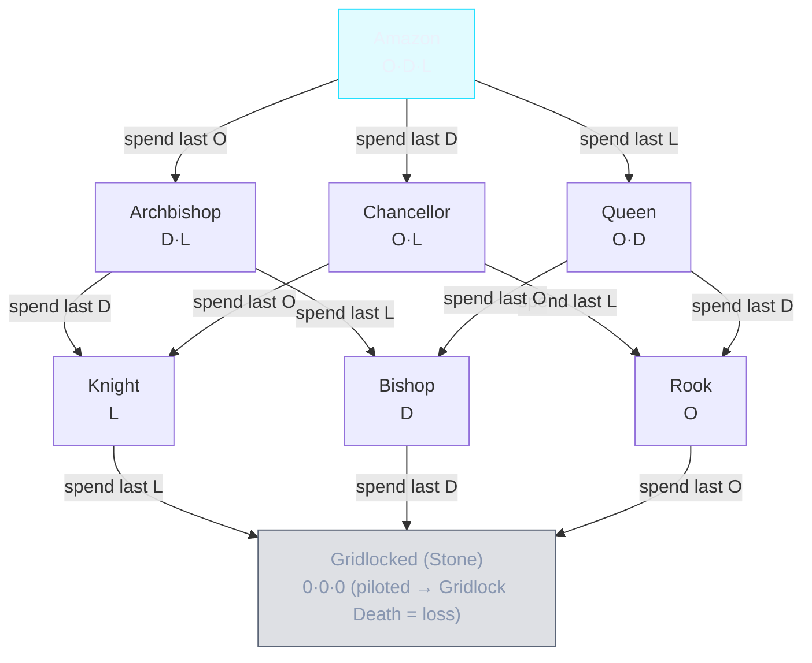

# Charge-Native Search Model — design reference for a future C++/Rust engine

> **Status:** DESIGN REFERENCE / NOT BUILT. This is the model a *purpose-built compiled engine*
> (C++/Rust → WASM) would use to search Gridlock **with charge depletion native**, i.e. where a
> piece's identity *changes as it spends charges* (Amazon → Chancellor → Knight → Stone). It exists
> so that IF we pursue the compiled-engine path (see DeepDepletionEnginePlan.md Option B / new engine)
> we already have the state model, the transition matrix, and the terminal rules written down.
>
> It is also the honest, corrected version of the "FSF does depth = charges" idea. Two things from
> that idea do **not** translate literally, and this doc fixes them up front (§1).

---

## 1. Two corrections up front (so the model is sound)

The intuition — *"look ahead as the piece spends charges, watch it degrade through the lattice, and
notice when a line turns it to a Stone"* — is **exactly right** and is the heart of this model. But
two specifics from the sketch must be corrected or the engine would be wrong:

1. **"FSF does this."** ❌ Fairy-Stockfish **cannot** — it's a fixed binary that treats each piece as
   a *constant* fairy type for its whole search (verified: it only accepts a FEN snapshot). The
   degradation-aware search must be **our own engine** (the TS overlay already does it *shallowly*;
   a compiled engine would do it *deeply*). So throughout this doc, the searcher is **"the engine"**
   (ours), not FSF. FSF, if kept, is only an *advisor/move-orderer*.

2. **"Overlay depth = the piece's total charges."** ❌ Category error. **Search depth counts game
   plies** (both players alternating). **Charges count how many times ONE piece can move.** A piece
   only spends a charge on a ply where *it* moves — between those, the opponent moves and your other
   pieces move. So a 10-charge piece fully depleting spans **far more than 10 plies** of real search
   (≈ 19+ if it moved every one of its turns, more in practice). Depth is **uniform** for the whole
   position; charges are **per-piece state carried in the position**. This doc models charges as
   **part of the position state**, decremented when that piece moves — which is the correct design.

With those fixed, the model below is a faithful, buildable design.

---

## 2. The state model — an Anomaly is a *trajectory*, not a piece

Each Anomaly carries a charge vector **`(O, D, L)`** (Orthogonal, Diagonal, Leap), or for Omni a
single **`shared`** pool. The rules (verified in `move.ts`/`movement.ts`):

- **Movement each ply = the union of the currently-live vectors** (`v > 0`). O = rook slides,
  D = bishop slides, L = knight leaps.
- **Moving spends exactly one charge** of the vector used for that move (`pool[vectorUsed] -= 1`).
- **Charges only go down, never up** ("batteries don't recharge") → the state space is a **DAG**
  (directed, acyclic — you can only fall).
- **Identity is decided by WHICH vectors are `> 0`, not their magnitude** (FairyCounterparts.md §1).
  So `(4,3,3)` and `(1,1,1)` are the **same** fairy piece (an Amazon) — they differ only in how many
  moves remain before a transition.
- **All zero → Dead Stone** (a **Gridlocked Anomaly** — immobile, blocks, capturable; see §2D). A
  **piloted royal** reaching `0/0/0` = **Gridlock Death** = instant loss.

So an Anomaly is a **point in charge-space that drifts downward**, and its *fairy identity* is the
lattice cell that point currently occupies.

---

## 2A. The starting armies — what the engine begins with (36 builds)

Per side (verified in `balancedArmy.ts` + `generator.ts`): **1 King + 7 Anomalies + 8 Pawns** on a
standard 8×8 board — King + 7 Anomalies fill the back rank (8 squares), pawns fill the second rank.

The **7 Anomalies** are drawn from the **36-build enumeration** (`enumerateBuilds`, drift-guarded by
`balancedArmy.spec.ts`) across the **10 starting archetypes** (11 total — the 11th, Omni, is
promotion-only). All 11, verified against `ARCHETYPE_REGISTRY` in `archetypes.ts` (builds shown in
the doc's **O · D · L** order; every non-Omni build sums to 10):

| # | Group | Archetype (`key`) | Callsign | Glyph | Charge build (**O · D · L**) |
| - | ----- | ----------------- | -------- | ----- | --------------------------- |
| 1 | Absolute | Absolute Leap (`absLeap`) | Motorbike | 🏍️ | `O0 · D0 · L10` |
| 2 | Absolute | Absolute Diagonal (`absDiag`) | Racing Car | 🏎️ | `O0 · D10 · L0` |
| 3 | Absolute | Absolute Orthogonal (`absOrtho`) | Car | 🚗 | `O10 · D0 · L0` |
| 4 | High | High Leap (`highLeap`) | Police Car | 🚓 | `O 1–3 · D 1–3 · L 6–8` |
| 5 | High | High Diagonal (`highDiag`) | Ambulance | 🚑 | `O 1–3 · D 6–8 · L 1–3` |
| 6 | High | High Orthogonal (`highOrtho`) | Firetruck | 🚒 | `O 6–8 · D 1–3 · L 1–3` |
| 7 | Hybrid | Hybrid Leap/Diag (`hybridLD`) | Plane | 🛩️ | `O 0–1 · D 4–6 · L 4–5` |
| 8 | Hybrid | Hybrid Leap/Ortho (`hybridLO`) | Airliner | ✈️ | `O 4–6 · D 0–1 · L 4–5` |
| 9 | Hybrid | Hybrid Diag/Ortho (`hybridDO`) | Rocket | 🚀 | `O 4–6 · D 4–5 · L 0–1` |
| 10 | Balanced | Balanced (`balanced`) | Chopper | 🚁 | `4 / 3 / 3` in any O/D/L order |
| 11 | Omni | Omni (`omni`) | Mech | 🤖 | `8 shared` — **PROMOTION ONLY** (never in the starting army; see §2C) |

Under the exact rules:

- **Each Anomaly = 10 charges** split across O/D/L per its archetype's build.
- **Exact vector budget:** the 7 Anomalies' charges sum to a permutation of **`{24, 23, 23}`** over
  Orthogonal/Diagonal/Leap (7 × 10 = 70 = 24 + 23 + 23). Uniformly sampled via a DP table (fallback-free).
- **≤ 2 Absolutes** (single-vector: absLeap/absOrtho/absDiag) and **≤ 2 duplicates** of any archetype.
- **Both armies mirrored** (same builds, mirrored placement) → macro-balanced and color-fair.
- **Opposite-color bishop pair** placement rule when two absDiag pieces roll.

Consequence for the engine: the opening is **random-but-balanced** (**5,950,517,760 ≈ 5.95 billion**
distinct starting positions; a new army every game). There is **no useful fixed opening book** — the engine must **evaluate the actual rolled
army from move 1**, understanding each piece's build and remaining runway.

## 2B. Override — a King can become a Piloted Royal / **Piloted Anomaly** (GridlockChess.md §6.1)

A **King may step onto an adjacent friendly, non-Omni, non-Gridlocked Anomaly** ("Override" /
"boarding"). Verified in `move.ts`:

- The King is **consumed**; the host Anomaly becomes **royal** (`piloted: true`) — a **piloted royal**,
  called a **Piloted Anomaly** in the Rules page & Coach (same thing; this doc says *piloted royal*
  to stress it is now the royal piece). **No capture, no charge spent**, and it is **irreversible**
  (resets repetition / fifty-move history).
- The **piloted royal now IS the royal piece** — it moves with the **host's live vectors** (same
  lattice/union rules) and **depletes like any Anomaly** as it moves.
- **Two ways to lose the royal:** (a) **Checkmate** of the piloted royal (like a King), OR
  (b) **Gridlock Death** — the piloted royal spends its **last** charge (reaches `0/0/0`) on its own
  move → **instant loss**. A plain King can never do this; only a piloted royal can. This is a
  **second loss condition** standard chess has no analogue for.
- **Engine implications:** Override is a **move type** the search must generate (at minimum for the
  *opponent* — a human may board; the bot's own standing policy is "never board"). The piloted royal
  contributes **0 material** (its loss is terminal, not a capture), but its **charge reserve matters**
  — draining it toward `0/0/0` is a winning plan, and keeping your own royal's escape vectors alive
  avoids mate (the royal-reserve eval term in §6).

## 2C. The rest of the move rules the engine must model (pawns, promotion, King, blocking)

Non-charge mechanics a standard chess engine would *assume* but which differ here (verified in
`move.ts` / `movement.ts`):

- **Pawns** move exactly as in standard chess — one forward, **two-square first move**, diagonal
  capture, **en passant** — and are **exempt from the Vector Economy** (no charges).
- **Promotion → Omni (Mech):** a Pawn reaching the back rank **auto-promotes to an Omni** with a
  **fresh 8-charge SHARED pool** (`createOmniAnomaly`). There is *no* piece choice, and this is the
  **only** way an Omni ever appears. The engine must model promotion as a move that **creates a new
  piece with a shared pool** (which then depletes straight-to-Gridlocked per §3's Omni exception).
- **King** moves **exactly one square** in any direction and is **charge-exempt**. **No castling
  exists** — do not generate castling moves (a common engine default that would be illegal here).
- **Blocking asymmetry (move-gen):** **Orthogonal (O) and Diagonal (D) are ray-blocked** — they stop
  at the first occupied square (`getSlidingMoves` breaks on any piece) — while **Leap (L) jumps over
  any piece** (friend, foe, or Stone) exactly like a knight. A **Gridlocked Stone** therefore **blocks
  O/D rays and occupies its square**, but **attacks nothing and can never give check** (no live
  vectors) — so it is a pure wall + a capture target, never a threat.

## 2D. Gridlock — the "Dead Stone" state (GridlockChess.md §5)

Throughout this doc, **"Stone" / "Dead Stone" = a Gridlocked Anomaly** — the canonical term in the
Rules page, Coach, and code (`isGridlocked`, `piece.isGridlocked`). It is the **bottom of the identity
lattice** (§3), reached the instant an Anomaly spends its **last** charge:

- **Standard Anomaly:** `O0 D0 L0` (all three vectors empty).
- **Omni:** `shared 0`.
- **Piloted royal:** reaching `0/0/0` triggers **Gridlock Death** (instant loss, §2B) — the game ends
  rather than leaving a playable Stone.

Verified in `movement.ts` (`isGridlocked`), a Gridlocked Anomaly is:

- **Immobile** — `getAnomalyMoves` returns an empty set, so it can never move again (charges only go
  down, so this is **permanent**).
- **A wall** — it still **occupies its square** and **blocks O/D rays** (but not L leaps, §2C).
- **Capturable** — it stays on the board as an ordinary capture target (worth ~0 to the eval, §6).
- **Inert** — it **attacks nothing and can never give check** (no live vectors). This is *why* Total
  Gridlock (§6) can be a draw: an all-Stone board can force no mate.

**Engine takeaway:** model a Stone as a *piece-shaped obstacle*, not a piece — occupancy that blocks
sliders, contributes ~0 material, and generates zero moves/attacks. The **transition into** a Stone
(an Anomaly spending its last charge) is the key event the depletion-aware search must score (§4):
it can be a blunder (a valuable piece self-destructs for nothing) or the fair price of a good trade.

---

## 3. The identity lattice (8 states) — the transition matrix

With three on/off vectors there are exactly `2³ = 8` identity states. Spending a vector that then
hits `0` moves you **down** one edge; spending a vector that stays `> 0` keeps the same identity
(only the countdown shrinks).

| # | Live vectors | Fairy identity | Betza | Spend **O** (last) → | Spend **D** (last) → | Spend **L** (last) → |
| - | ------------ | -------------- | ----- | --- | --- | --- |
| 1 | O · D · L | **Amazon** (QN) | `QN` | Archbishop (D·L) | Chancellor (O·L) | Queen (O·D) |
| 2 | D · L | **Archbishop** (BN) | `BN` | — | Knight (L) | Bishop (D) |
| 3 | O · L | **Chancellor** (RN) | `RN` | Knight (L) | — | Rook (O) |
| 4 | O · D | **Queen** (BR) | `Q` | Bishop (D) | Rook (O) | — |
| 5 | L | **Knight** (N) | `N` | — | — | **Gridlocked** |
| 6 | D | **Bishop** (B) | `B` | — | **Gridlocked** | — |
| 7 | O | **Rook** (R) | `R` | **Gridlocked** | — | — |
| 8 | — | **Gridlocked** (Stone) | `-` | — (immobile) | — | — |

("—" = that vector is already 0, so it can't be spent from that state.)

### The fall-lines (Mermaid)



**Omni exception:** a single `shared` pool feeds all three move types, so Omni stays an **Amazon**
the whole way down and drops **straight to Gridlocked** when `shared` hits 0 (no intermediate states).

---

## 4. Worked trajectory — the "Chopper" `(O3 · D3 · L4)` = Amazon

This is the example from the request, **corrected to plies** (the piece moves on *its* turns only;
the opponent moves in between — omitted here for clarity, but real search interleaves them):

| Its move # | Vector spent | Charge state after | Identity now |
| ---------- | ------------ | ------------------ | ------------ |
| start | — | `O3 D3 L4` | **Amazon** |
| 1 | O | `O2 D3 L4` | Amazon (O still live) |
| 2 | O | `O1 D3 L4` | Amazon |
| 3 | O | `O0 D3 L4` | **Archbishop** (O died) |
| 4 | D | `O0 D2 L4` | Archbishop |
| 5 | D | `O0 D1 L4` | Archbishop |
| 6 | D | `O0 D0 L4` | **Knight** (D died) |
| 7 | L | `O0 D0 L3` | Knight |
| 8 | L | `O0 D0 L2` | Knight |
| 9 | L | `O0 D0 L1` | Knight |
| 10 | L | `O0 D0 L0` | **Gridlocked** (Stone) |

So over its **own 10 moves**, the Chopper walks Amazon → Archbishop → Knight → Stone. The engine
scores each resulting position (a Stone is worth ~0; a piloted royal at `0/0/0` = a **loss**), so it
can see that a line ending in *"my valuable Chopper becomes a Stone for nothing"* is bad — and prefer
a different plan. **Crucially:** whether that's *good or bad* depends on WHAT the Chopper achieved on
the way (it may have captured three enemy pieces first). Depletion is the game's core mechanic, **not
automatically a loss** — the engine judges the *resulting position*, never a blanket "Stone = lose".

---

## 5. The charge-native negamax (algorithm sketch)

**In plain English.** Negamax is just *“try every one of my moves; for each, assume the opponent then
plays *their* best reply, and *their* opponent replies best, … down to a depth limit; then score the
resulting positions and pick the move that leaves me best off.”* It walks the game as a tree (my move
→ their reply → my reply …), scores the leaf positions, and passes the best score back up. Two tricks
keep it fast: **alpha-beta** abandons a move the moment it's proven worse than one already found (the
`α ≥ β` cutoff), and the **depth** limit caps how far ahead it looks. The “nega” is the `-negamax(…)`
sign flip — a position that's +5 for me is −5 for my opponent, so we always score from the side to
move and negate on the way up.

The **only** Gridlock-specific part is the `apply` step: when a piece moves it **spends one charge of
the vector it used**, which may change that piece's identity or turn it into a Gridlocked Stone — and
that new charge state is carried into the child position. So the search literally *watches pieces
deplete* as it looks ahead, instead of pretending each piece stays the same forever (which is exactly
what FSF does). Everything else below is a textbook negamax.

```
negamax(pos, depth, α, β):
    if terminal(pos): return terminalScore(pos)          # checkmate / stalemate / repetition / king-captured / gridlock-death
    if depth == 0:    return quiescence(pos, α, β)
    best = -∞
    for each legal move m of side-to-move in pos:         # moves derived from each piece's LIVE vectors
        child = apply(pos, m)                             # ← spends the used vector: pool[vec(m)] -= 1,
                                                          #   recomputes identity, may become Gridlocked / trigger
                                                          #   Gridlock-Death, may capture, EP, promote
        best = max(best, -negamax(child, depth-1, -β, -α))
        α = max(α, best); if α ≥ β: break                 # alpha-beta cutoff
    return best
```

The **only** Gridlock-specific parts (everything else is standard negamax):

- **Move generation reads each piece's *current* live vectors** (§3) — so a degraded piece
  automatically generates fewer move types.
- **`apply` decrements the spent vector and recomputes identity** — this is where the trajectory
  happens, *inside the search state*, ply by ply. **This is the piece the C++/Rust engine must own
  natively** (a "depleting-pool piece"), and it's exactly what FSF cannot represent.
- **The position hash / transposition key MUST include every piece's charge vector** — two boards
  with identical placement but different charges are **different positions** (they have different
  legal moves and different values).

> **This is an idealized sketch, not the literal code.** The real `search.ts` negamax adds the
> standard performance/correctness layers omitted above for clarity: a **transposition table** (keyed
> by the charge-aware hash), **path-repetition** detection (a repeat on the current line scores 0),
> **move ordering** (TT-move → MVV-LVA → history), and a **quiescence** search at the leaves. Also,
> king-capture and gridlock-death are checked *per child move* (not at node entry as the
> `terminal(pos)` line implies), and **total-gridlock + the fifty-move clock live in the game layer
> (`outcome.ts`), not the search** — see §6.

---

## 6. Terminal & evaluation rules (verified against the TS engine)

| Condition | Result |
| --------- | ------ |
| Side to move has no legal move + in check | **Checkmate** (loss) |
| Side to move has no legal move, not in check | **Stalemate** (draw) |
| A move captures the enemy royal | **Win** |
| A move spends the mover's own **piloted royal's** last charge | **Gridlock Death** (loss) |
| Every Anomaly on the board Gridlocked + no pawn can move | **Total Gridlock** (draw) |
| Position repeats | **Repetition** (draw — game rule is *threefold*; a search treats any repeat in the current line as a draw) |
| 100 half-moves with no pawn move, no capture, no charge spent | **Fifty-move rule** (draw — fires only in the all-Anomalies-gone K+P endgame; complements Total Gridlock) |

> **Two honesty notes on this table.** (1) **Precedence matters:** `outcome.ts` resolves in a fixed
> order — gridlock-death → checkmate → stalemate → (threefold) repetition → total-gridlock →
> fifty-move. (2) **Where each is checked *today*:** the current *search* (`search.ts`) detects only
> enemy-royal capture, own gridlock-death, and checkmate/stalemate (no-legal-move), and treats **any**
> repeat on the current line as a draw (two-fold-in-tree, not the game's three-fold). Total-gridlock,
> the three-fold count, and the fifty-move clock live in the **game layer** (`outcome.ts`), NOT the
> search — a future charge-native engine must fold them into its own terminal test.

**Leaf evaluation** (minimum viable, from today's TS overlay — a compiled engine would enrich it):
- Material by charges: `Anomaly = 100 + 55·(remaining charges)` (`ANOMALY_BASE + CHARGE_VALUE`),
  **Gridlocked = 0**, Pawn = 100, **royal material = 0** (a royal's loss is a terminal, not a capture).
- **Piloted-royal charge reserve** (ALWAYS on): `+8 per remaining charge` of a *piloted* royal
  (`ROYAL_RESERVE_VALUE`), kept far below `CHARGE_VALUE` so it only breaks ties — lets the search
  conserve its own royal and drain the enemy's toward Gridlock Death.
- A light check term (`±25`).
- ⚠️ **Honest gap:** this eval has **no real positional understanding** (king safety, activity, pawn
  structure). That is the single biggest lever for real strength — a compiled engine's win is only as
  good as this evaluation. (This is why FSF, whose eval is strong, is worth keeping as an advisor.)

---

## 7. The search covers ALL anomalies, both colors

This is **automatic** in the model above: negamax generates moves for *every* piece of the
side-to-move (all your anomalies) and recurses into the opponent's replies (all their anomalies),
for both sides, at every node. There is no per-piece special-casing — the whole position, both
colors, is searched with charges native. So "the full arsenal for every anomaly" = **just run this
negamax on the whole board.** (The TS overlay already does this; it's simply too shallow.)

---

## 8. Why this needs C++/Rust (not TypeScript)

- **Branching + depletion explode the tree.** Every piece × every legal move × the charge state → a
  huge node count. Reaching useful depth needs **millions of nodes/second**.
- **TypeScript is ~10–50× too slow** for this: it runs on a VM with **garbage collection**, and a
  charge-aware search allocates a fresh position per node → constant GC pressure. It tops out shallow.
- **C++/Rust compile to native code, no GC**, use **bitboards** and **make/unmake in place** (no
  allocation per node) → the depth that makes "watch the piece degrade to a Stone" actually strong.
- For the phone, ship it as **WebAssembly** (compile C++/Rust → WASM), which runs in the app at
  near-native speed (still ~10× faster than JS).

### Complexity intuition
A true depth `d` full-width search is ≈ `b^d` nodes (`b` ≈ 40–60 here). Even with alpha-beta
(`≈ b^(d/2)`), depth 10 is ~`40^5 ≈ 10^8` nodes **per move** — feasible in native code, not in JS.
That gap **is** the reason for the language choice; it is not about what logic TS *can* express
(TS expresses it fine — that's the overlay), only how *fast*.

---

## 9. Build order if we ever pursue this (measure-first)

The single governing principle: **prove the *design* wins before paying for a rewrite.** Prototype the
eval + search in TypeScript (extend `search.ts`) and benchmark vs the current bot; only if it *clearly*
wins do you port the proven design to Rust/C++ → WASM (keeping the TS version as a move-for-move
reference oracle); and keep **FSF as advisor + offline fallback** throughout. (Priors say depletion
tweaks wash — so this gate matters.) The full, code-verified staged roadmap — with the ranked
fork-vs-scratch decision, the ROI reality check, and the benchmark-harness prerequisite — is in **§11**.

> **Bottom line:** this model is the correct, buildable form of the "watch the anomaly deplete to a
> Stone" idea. FSF can't host it; the depth that makes it strong needs a compiled engine; and the
> honest prerequisite is proving the *evaluation* is good enough — because depth on a crude scorecard
> is a fast way to be confidently wrong.

---

## 10. Complete mechanics the engine must model — awareness checklist

For "full understanding" (the s-tier bar), the charge-native engine must natively handle **every** row
below. Each is verified against the current TS rules:

| # | Mechanic | What the engine must do | Source of truth |
| - | -------- | ----------------------- | --------------- |
| 1 | **36 anomaly builds / balanced armies** | Evaluate the *actual rolled* army from move 1 (no fixed book); understand each build's charge split | `balancedArmy.ts`, `archetypes.ts` |
| 2 | **Charge depletion per move** | Decrement the used vector by 1 on every Anomaly move, in the search state | `move.ts` |
| 3 | **Shape-change on last-charge burn** | Derive moves from CURRENT live vectors each ply; identity falls down the lattice when a vector hits 0 | `movement.ts`, §3 |
| 4 | **Gridlock (Stone)** | 0/0/0 non-royal Anomaly = immobile blocker, worth ~0, still capturable + blocks squares | `movement.ts` `isGridlocked` |
| 5 | **Override → Piloted Royal** | King boards a friendly non-Omni Anomaly → royal, no charge spent, irreversible; model as a move (≥ opponent) | `move.ts`, §2B |
| 6 | **Gridlock Death** | Piloted royal reaching 0/0/0 on its move = instant loss (the second loss condition) | `move.ts`, `outcome.ts` |
| 7 | **Checkmate** | King / piloted royal with no legal move while in check = loss | `check.ts`, `outcome.ts` |
| 8 | **Stalemate** | No legal move, not in check = draw | `outcome.ts` |
| 9 | **Total Gridlock** | All Anomalies gridlocked + no pawn can move = draw (thematic 50-move replacement) | `outcome.ts` `isTotalGridlock` |
| 10 | **Repetition** | Repeated position = draw | `outcome.ts`, §6 |
| 11 | **Charges in the position hash** | Same placement + different charges = DIFFERENT positions (correct transposition table) | §5 |
| 12 | **Pawn promotion → Omni** | Pawn reaching the back rank auto-becomes an Omni (Mech) with a fresh **8-charge SHARED pool** — the only source of an Omni; model as a move that creates a new piece-state | `move.ts`, `archetypes.ts` |
| 13 | **Fifty-move rule** | 100 half-moves with no pawn move / capture / charge spend = draw (K+P endgame backstop) | `outcome.ts` `FIFTY_MOVE_HALFMOVES` |
| 14 | **Move-gen quirks** | No castling (King = 1 square); Leap JUMPS over any piece incl. Stones; O/D are ray-blocked; a Stone blocks O/D + occupancy but attacks nothing (no check) | `movement.ts`, GridlockChess.md §1–2 |

> **The one-line s-tier bar:** the engine treats an Anomaly as *"a piece whose move-set AND value both
> shrink as it spends charges, which dies to a Stone at zero, which a King can fuse with to become a
> royal, and which — as that royal — loses the instant it runs dry."* Model all of that natively in the
> search state, evaluate the *resulting* positions (never a blanket "depletion = bad"), and you have
> the complete-awareness engine.

---

## 11. Recommended approach & roadmap (validated against code, 2026-07)

> Every claim here was checked against source: `server.js` (engine setup), `bot.ts`
> (`DIFFICULTY_CONFIG`, `SEARCH_BUDGET`, authority flow), `search.ts` (eval), `package.json`, and the
> shipped dev docs. Estimates are labelled as such.

> **Status (2026-07-22):** Deep mode removed and **on-device confirmed** — the bot plays normally (no
> king-march) and feels, if anything, slightly stronger. This project is now **SHELVED as a design
> reference**: the deep experiment already answered the key question (the *eval*, not depth, is the
> bottleneck), the bot is shipped-quality, and the priors say tweaks wash. **Trigger to revisit:** a
> concrete in-play weakness — most likely a **gridlock-death endgame** where the bot mismanages a
> piloted royal. No scheduled work; §11.6 (benchmark harness) is step 1 *if* it is ever revisited.

### 11.1 The decision — ranked

**Recommendation: do NOT fork FSF, and do NOT rewrite yet. First prove a stronger *evaluation* in the
existing TypeScript overlay against a *valid* benchmark. Build a from-scratch Rust → WASM charge-native
engine ONLY if that gate clearly wins. Keep FSF as advisor + fallback throughout.**

| Option | Verdict | Why |
| ------ | ------- | --- |
| **A. Fork Fairy-Stockfish** | ✗ Not recommended | You must still build a depletion-aware eval *and* alter FSF's static-piece core — the hard parts — inside a large, unfamiliar C++ codebase (§11.2). |
| **B. Build from scratch (Rust → WASM)** | ✓ Eventual s-tier target — *gated* | Native "depleting-pool piece" (§2, §5) + you own the eval. But it must *beat* today's deep FSF — a high bar (§11.3). |
| **C. Evolve the TS overlay** | ✓ The correct *next* step | Already charge-accurate with TT / repetition / `positionKey` (§5). Use it to prove the eval before paying for a rewrite. GC-bound, so not the final engine. |
| **D. Keep the current FSF-advisor + overlay** | ✓ The honest default | Verified strong, only charge-blind (§11.3). The most likely rational outcome. |

### 11.2 Why NOT fork FSF (the "NNUE" argument is a red herring — corrected)

A common case for forking is "you'd lose FSF's NNUE." **For Gridlock that is false.** `server.js`
loads the variant with `VariantPath` + `UCI_Variant` + `Threads` + `Hash` and **no `EvalFile`**
(verified) → the custom `gridlock` variant runs FSF's **classical** eval, not NNUE (also stated in
`BotStrengthEnhancementPlan.md`, `DeepDepletionEnginePlan.md §29`, `NativeEngineBuildGuide.md`). There
is no trained net to lose. The *real* fork problems:

- FSF's search assumes **static piece types** (a fixed Betza string for the whole search). Gridlock
  pieces change move-set *and* identity as they deplete → you'd rewrite move-gen, the piece model, and
  the Zobrist hash (charges must enter the key).
- FSF's classical eval **does not understand depletion**, so you'd still write the charge-aware eval
  from scratch (the hard part, §6) — only now buried inside a large C++ engine you didn't author.
- Net: a fork buys FSF's search *scaffolding* but leaves the two hardest jobs undone, at higher
  integration cost. A purpose-built engine does them cleanly.

### 11.3 Critical context — the current bot is *strong*, only charge-blind

Verified in `bot.ts` `DIFFICULTY_CONFIG`: FSF searches to **depth 20–24 at Skill 20** for the top
tiers (`grandmaster: depth 20`, `asi: depth 24`). The *shape*-play is already ~GM-level. The
architecture (verified — `bot.ts` header + `SEARCH_BUDGET` comment):

1. FSF proposes MultiPV-ranked candidates on a `position fen … ; go …` **snapshot** (`server.js`).
2. Our rules re-filter for legality — *"the engine can't see depleting vector pools"* (`bot.ts`).
3. The charge-aware overlay (`search.ts`, `maxDepth ≤ 8`, skilled+ tiers only) **overrides FSF only
   when it proves a materially better move** under the real rules.

> The current bot's **Gridlock-awareness inventory** — the Stone `immobile = x` encoding, royal-charge
> conservation (`ROYAL_RESERVE_VALUE`), the override margin, `preferForcingWin`, and override-in-tree —
> is cataloged in `BotDepletionAwareness.md` §13. That is the depletion awareness the *current* bot
> already has; this doc scopes a *future* engine that would search it *deeply*.

So the ONLY gap a new engine can close is the **depletion / gridlock-death dimension** FSF is blind
to — *not* general strength. That makes the ROI **narrow** and the bar **high**: a from-scratch engine
must out-search FSF's depth-20–24 shape play *and* add charge-awareness.

### 11.4 The evidence says "measure before you build" — and deep mode now HAS been measured

- A **valid** 114-game self-play A/B (asi override-margin 80 vs 150, fixed nodes) came out a
  **statistical wash: +12 Elo ± ~65** (documented in the `bot.ts` `SEARCH_BUDGET` comment).
  Depletion-*override tuning* did not move strength.
- **Deep mode is now MEASURED — and it FAILED (on-device, 2026-07-22).** With `deepMode` force-enabled
  on the phone (the authority-handoff: `overrideMargin 0` → the overlay *leads* instead of only vetoing
  FSF), the L8 bot played absurdly — it **marched its King straight up from rank 1 to rank 8**. Handed
  the wheel, the overlay's crude material + centrality eval has **no king-safety** and drives suicidal
  king walks; extra depth did not save it. (A separate 200-game deep A/B was *also* invalid — proxy
  drop → heuristic noise — but this direct observation is decisive on its own.)

This is the **definitive result the design predicted** (§6 "honest gap"): **the bottleneck is the
overlay's evaluation, not its search depth — and handing the overlay authority actively hurts.** So a
strong incumbent + a washed tuning experiment + a **failed** deep mode ⇒ evolving the overlay into the
boss is worth it *only after* a proper positional (ideally NNUE) evaluation exists — exactly the §11.5
gate. Deep mode is reverted to **default OFF** and stays there.

### 11.5 The roadmap (measure-first)

0. **DONE** — charge-aware TS negamax: TT, charge-aware `positionKey`, repetition, override-in-tree,
   deep-mode, all behind a flag (`search.ts`). **Deep mode was on-device tested → FAILED (§11.4) →
   reverted to default OFF.** The *safe* parts (TT, repetition, `positionKey`) are pure upgrades and stay on.
1. **Fix the benchmark harness FIRST** (§11.6) — nothing downstream is trustworthy without it.
2. **Strengthen the TS eval** (close the §6 gap: king-safety / activity / pawn structure) and run a
   *valid* A/B vs the current bot. **Gate:** a real, non-washed Elo gain.
3. **Only if step 2 wins:** port the proven design to **Rust → WASM** for depth; keep the TS engine as
   a move-for-move **reference oracle**. (FSF already ships as WASM — `fairy-stockfish-nnue.wasm` in
   `package.json` — so a second WASM engine coexists fine.)
4. **s-tier eval:** a small **NNUE trained on Gridlock self-play** — the real long-term strength lever.
5. Keep **FSF as advisor / move-orderer / offline fallback** at every stage.

### 11.6 Prerequisite — a trustworthy benchmark (the blocker we actually hit)

Fix the self-play harness before any gate:
- Run the engine **in-process** (native / WASM), not over the flaky dev HTTP proxy. *(Live proof it's
  flaky: `npm run dev:server` and `npm run dev:all` are exiting `1` in this very session.)*
- **Deterministic seeds**, and **hard-fail on ANY heuristic fallback** so an invalid run can never
  masquerade as valid — the exact trap that voided the deep A/B (validity was console-only, hidden
  from the log file).

### 11.7 Issues we hit (verified, or flagged as session history)

1. **FSF is charge-blind** — it gets a `position fen … ; go` snapshot; it sees a piece's current
   *shape*, not its charge *magnitude* nor that pools deplete over its line (`server.js`; `bot.ts`
   comment; `FairyCounterparts.md §6.2–6.3`).
2. **Gridlock-death is invisible to FSF** — the `gridlock-royal` variant gives it the royal's current
   shape but no charge countdown, so it can't find deep forced gridlock-death wins (`bot.ts`
   `hasPilotedKing` comment).
3. **The overlay is shallow** — `SEARCH_BUDGET maxDepth ≤ 8`, GC-bound TS (verified `bot.ts`).
4. **The eval has no positional understanding** — material-by-charges + royal-reserve + a `±25` check
   term, nothing else (verified `search.ts`). Biggest lever, unbuilt.
5. **Override-margin tuning washed** — 114-game A/B, +12 ± 65 Elo (`bot.ts` comment).
6. **Deep mode FAILED on-device (2026-07-22)** — force-enabled on the phone, the L8 bot marched its
   King rank 1 → 8 (authority-handoff + crude, king-safety-blind eval = suicidal king walk). Confirms
   the **eval, not depth**, is the bottleneck. Deep mode reverted to default OFF; the temp
   `LocalGame.tsx` force-on hack removed. (A separate 200-game A/B was also invalid — proxy drop.)
7. **The dev proxy is unreliable** for long runs (live: exit code `1` this session).
8. **Dead-stone misread (fixed)** — FSF treated gridlocked anomalies as mobile until the
   `immobile = x` variant fix; a concrete case of the static model misjudging Gridlock.

### 11.8 Blunt bottom line

- **s-tier *target*:** a from-scratch **Rust → WASM** charge-native engine, eventually NNUE-evaluated.
- **Correct *next move*:** fix the benchmark, then prove a better eval in TS. Do **not** fork FSF.
- **Most likely honest outcome:** the current FSF-advisor + overlay is already strong; a *valid*
  benchmark may well show a new engine isn't worth it outside gridlock-death endgames. That is a
  **result, not a failure** — it is exactly why you measure before you build.

> See also `DeepDepletionEnginePlan.md` (Option A vs B, Phase 0 status) — this section supersedes its
> recommendation framing with the code-verified evidence above.
