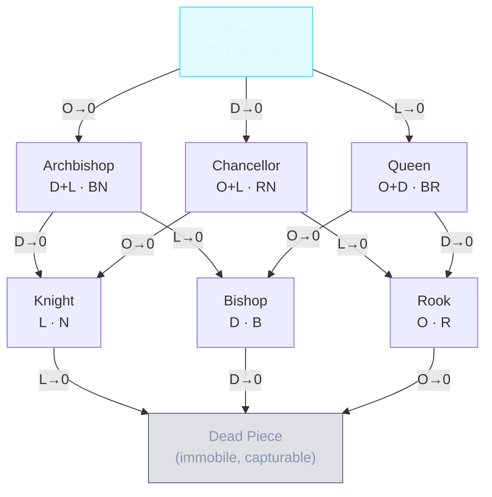

# Gridlock Chess — Fairy Piece Counterparts

> **Status:** Implemented. The lattice is enforced in `src/lib/chess/movement.ts` (`getAnomalyMoves`), and mapped to Fairy-Stockfish glyphs in `src/lib/chess/engine.ts` (`pieceToFenChar`).
> **Purpose:** Map each of the 11 Anomaly archetypes (10 starting + Omni promotion) to their
> classical *fairy chess* counterparts, and define how each piece's **effective movement
> degrades** as its charge vectors deplete — *without ever changing the piece's icon.*

---

## 1. Core Insight — Identity vs. Movement

In Gridlock Chess, every Anomaly carries a **charge pool** split across three movement
vectors:

| Vector | Symbol | Movement | Classical equivalent |
| ------ | ------ | -------- | -------------------- |
| **Orthogonal** | `O` | Rook-style orthogonal slide | **Rook** (`R`) |
| **Diagonal**   | `D` | Bishop-style diagonal slide | **Bishop** (`B`) |
| **Leap**       | `L` | 8 knight L-jumps          | **Knight** (`N`) |

The single most important rule for this whole document:

> **A piece's fairy identity is determined by *which* vectors are still `> 0`,
> NOT by how many points remain in them.**

A `balanced` piece with `3O/3D/4L` and one with `1O/1D/1L` are **the same fairy piece**
(an Amazon) — they differ only in how many moves they have left before transitioning.

This means each Anomaly is not *a* fairy piece — it is a **trajectory** through a lattice
of fairy pieces, sliding "downhill" as vectors hit zero.

### The icon never changes

The archetype's **icon/emblem stays fixed for the entire life of the piece.** A `balanced`
piece always shows 🚁 (its Chopper glyph) — even when it has degraded from
an Amazon down to a lone Knight, and finally to a Dead Piece. Players read the **current
vector badges (`O/D/L` corners)** to know its *present* movement; the icon only tells them
its *original* archetype.

> **UI consequence:** Movement is communicated by the live vector badges, not the glyph.
> The glyph is identity; the badges are state. This separation is the heart of the design.

---

## 2. The Fairy-Piece Lattice (8 States)

With three independent on/off vectors, there are exactly `2³ = 8` movement states. Every
Anomaly lives somewhere in this lattice and can only ever move **downward** (vectors deplete,
never refill — *"batteries do not recharge"*).

| State | O | D | L | Fairy piece | Betza | Also known as |
| ----- | - | - | - | ----------- | ----- | ------------- |
| **Amazon**     | ✅ | ✅ | ✅ | Knight + Bishop + Rook | `QN` (`BRN`) | Superqueen, Maharajah, Omnipotent Queen |
| **Archbishop** | ⬜ | ✅ | ✅ | Knight + Bishop        | `BN` | Cardinal, Princess, Janus, Minister |
| **Chancellor** | ✅ | ⬜ | ✅ | Knight + Rook          | `RN` | Marshall, Empress, Concubine |
| **Queen**      | ✅ | ✅ | ⬜ | Bishop + Rook          | `Q` (`BR`) | — |
| **Knight**     | ⬜ | ⬜ | ✅ | Knight only            | `N` | — |
| **Bishop**     | ⬜ | ✅ | ⬜ | Bishop only            | `B` | — |
| **Rook**       | ✅ | ⬜ | ⬜ | Rook only              | `R` | — |
| **Dead Piece** | ⬜ | ⬜ | ⬜ | *Immobile obstacle*    | `-` (no atoms) | Stone, Rock, Wall, Dead Piece |

### Lattice diagram

> **Read it as gravity:** a piece enters the lattice at its starting state and can only fall.
> The *path* it takes is chosen by the player each time they decide which vector to spend.

---

## 3. The Dead Piece (Stone)

When **all three vectors reach `0`**, the Anomaly becomes a **Dead Piece** — the
Gridlock equivalent of the classical fairy *Stone / Rock / Wall*.

| Property | Behavior |
| -------- | -------- |
| **Movement** | None. Zero legal moves. |
| **Captured by enemy** | ✅ Yes — a normal capture target. |
| **Captured by own side** | ❌ No — you can never capture your own pieces (standard rule). |
| **Blocks squares** | ✅ Yes — still occupies its square; blocks sliders and denies landing squares. |
| **Betza** | `-` (empty move definition / no atoms). |

### Why this is *not* just a classical Stone

In fairy chess a Stone is **born** immobile. In Gridlock Chess a Dead Piece is **emergent** —
any Anomaly *decays* into one when its batteries run dry. The strategic novelty is the
**timing**: *when* a piece dies, and *which* vector you exhaust last, is a player decision.

> **Which pieces can become Dead Pieces?** Only **Anomalies** (the 10 archetypes) and **Omni**
> have charge pools, so only they can decay. **Kings and Pawns have no `vectors` field**
> (verified in `types/game.ts`) and therefore *never* become Dead Pieces — a Pawn either
> promotes or is captured; a King is never immobilized by charges.

---

## 4. Per-Archetype Degradation Plans

Notation: each state shows the **live vectors** and its **fairy identity**. The icon column is
the *fixed* emblem that never changes. Paths marked *(player choice)* mean the order of
descent depends on which vector the player spends.

> **Reminder:** values shown (e.g. `4L`) are *starting* points; the fairy identity ignores the
> magnitude and looks only at whether each vector is `> 0`.

> **⚠ The "typical path" rows below are illustrative, NOT enforced.** The engine imposes no
> preferred depletion order — a player may spend any live vector in any order. The paths shown
> simply reflect how a piece is *likely* to be played given its deep/thin vectors; every other
> path through the lattice in §2 is equally legal.

---

### 4.1 Balanced — icon 🚁 (Chopper)

Starting pool: `4 / 3 / 3` shuffled across O/D/L → **all three live → Amazon.**

This is the canonical example. Worked path (player spends O, then D, then L):

| Step | Pool | Live vectors | Fairy identity |
| ---- | ---- | ------------ | -------------- |
| Start         | `3O / 3D / 4L` | O D L | **Amazon** (`QN`) |
| After 3 O used | `0O / 3D / 4L` | D L   | **Archbishop** (`BN`) |
| After 3 D used | `0O / 0D / 4L` | L     | **Knight** (`N`) |
| After 4 L used | `0O / 0D / 0L` | —     | **Dead Piece** |

Because descent is player-driven, **every** path through the lattice from Amazon is reachable:

- Spend `O` first → Amazon → **Archbishop** → Knight/Bishop → Dead
- Spend `D` first → Amazon → **Chancellor** → Knight/Rook → Dead
- Spend `L` first → Amazon → **Queen** → Bishop/Rook → Dead

🚁 stays on the board the whole time. Only the badges and legal moves change.

---

### 4.2 High Leap — icon 🚓 (Police Car)

Starting pool: `O ≥ 1`, `D ≥ 1`, `L = 6–8` → **all three live → Amazon.**

Same lattice as Balanced, but L is deep and D/O are shallow, so it **naturally collapses
toward Knight** as the thin D/O vectors drain first under normal play.

| Typical path | Pool | Identity |
| ------------ | ---- | -------- |
| Start          | `1O / 2D / 7L` | **Amazon** |
| O exhausted    | `0O / 2D / 7L` | **Archbishop** |
| D exhausted    | `0O / 0D / 7L` | **Knight** |
| L exhausted    | `0 / 0 / 0`    | **Dead Piece** |

> *Flavour:* a raptor that ranges widely at first, then settles into pure pounce (Knight),
> then falls. All reachable states identical to Balanced — only the *likely* path differs.

---

### 4.3 High Diagonal — icon 🚑 (Ambulance)

Starting pool: `O ≥ 1`, `D = 6–8`, `L ≥ 1` → **Amazon.**

| Typical path | Pool | Identity |
| ------------ | ---- | -------- |
| Start          | `2O / 7D / 1L` | **Amazon** |
| L exhausted    | `2O / 7D / 0L` | **Queen** (`BR`) |
| O exhausted    | `0O / 7D / 0L` | **Bishop** |
| D exhausted    | `0 / 0 / 0`    | **Dead Piece** |

Naturally collapses toward **Bishop**.

---

### 4.4 High Orthogonal — icon 🚒 (Firetruck)

Starting pool: `O = 6–8`, with `D ≥ 1` and `L ≥ 1` → **Amazon.**

| Typical path | Pool | Identity |
| ------------ | ---- | -------- |
| Start          | `7O / 2D / 1L` | **Amazon** |
| L exhausted    | `7O / 2D / 0L` | **Queen** (`BR`) |
| D exhausted    | `7O / 0D / 0L` | **Rook** |
| O exhausted    | `0 / 0 / 0`    | **Dead Piece** |

Naturally collapses toward **Rook**.

---

### 4.5 Hybrid Leap/Diag — icon 🛩️ (Plane)

Starting pool: `O = 0–1`, `D = remainder`, `L = 4–5`.

- If `O = 0` → starts as **Archbishop** (`L + D`, `BN`).
- If `O = 1` → starts as **Amazon** (briefly, until the single O is spent).

| Path (O=1 case) | Pool | Identity |
| --------------- | ---- | -------- |
| Start         | `1O / 4D / 5L` | **Amazon** |
| O exhausted   | `0O / 4D / 5L` | **Archbishop** (`BN`) |
| D exhausted   | `0O / 0D / 5L` | **Knight** *(or →Bishop if L spent first)* |
| All exhausted | `0 / 0 / 0`    | **Dead Piece** |

Core identity: **Archbishop** that ends as Knight or Bishop.

---

### 4.6 Hybrid Leap/Ortho — icon ✈️ (Airliner)

Starting pool: `O = remainder`, `D = 0–1`, `L = 4–5`.

- If `D = 0` → starts as **Chancellor** (`L + O`, `RN`).
- If `D = 1` → starts as **Amazon** until the single D is spent.

| Path (D=1 case) | Pool | Identity |
| --------------- | ---- | -------- |
| Start         | `4O / 1D / 5L` | **Amazon** |
| D exhausted   | `4O / 0D / 5L` | **Chancellor** (`RN`) |
| O exhausted   | `0O / 0D / 5L` | **Knight** *(or →Rook if L spent first)* |
| All exhausted | `0 / 0 / 0`    | **Dead Piece** |

Core identity: **Chancellor** that ends as Knight or Rook.

---

### 4.7 Hybrid Diag/Ortho — icon 🚀 (Rocket)

Starting pool: `O = remainder`, `D = 4–5`, `L = 0–1`.

- If `L = 0` → starts as **Queen** (`D + O`, `BR`).
- If `L = 1` → starts as **Amazon** until the single L is spent.

| Path (L=1 case) | Pool | Identity |
| --------------- | ---- | -------- |
| Start         | `4O / 5D / 1L` | **Amazon** |
| L exhausted   | `4O / 5D / 0L` | **Queen** (`BR`) |
| O exhausted   | `0O / 5D / 0L` | **Bishop** *(or →Rook if D spent first)* |
| All exhausted | `0 / 0 / 0`    | **Dead Piece** |

Core identity: **Queen** that ends as Bishop or Rook.

---

### 4.8 Absolute Leap — icon 🏍️ (Motorbike)

Starting pool: `0O / 0D / 10L` → **Knight** from birth. No branching.

| Path | Pool | Identity |
| ---- | ---- | -------- |
| Start       | `0 / 0 / 10L` | **Knight** (`N`) |
| L exhausted | `0 / 0 / 0`   | **Dead Piece** |

A pure Knight with a very deep tank (10 jumps) before it dies.

---

### 4.9 Absolute Diagonal — icon 🏎️ (Racing Car)

Starting pool: `0O / 10D / 0L` → **Bishop** from birth.

| Path | Pool | Identity |
| ---- | ---- | -------- |
| Start       | `0 / 10D / 0` | **Bishop** (`B`) |
| D exhausted | `0 / 0 / 0`   | **Dead Piece** |

---

### 4.10 Absolute Orthogonal — icon 🚗 (Car)

Starting pool: `10O / 0D / 0L` → **Rook** from birth.

| Path | Pool | Identity |
| ---- | ---- | -------- |
| Start       | `10O / 0 / 0` | **Rook** (`R`) |
| O exhausted | `0 / 0 / 0`   | **Dead Piece** |

---

### 4.11 Omni — icon 🤖 (promotion only)

Starting pool: **8 shared points**, spendable on *any* vector on demand.

This is the truest **Amazon** in the set: as long as `shared > 0`, all three move types are
available, so it **stays an Amazon for its entire life** and then drops straight to Dead Piece
when the shared pool empties — it does **not** pass through the intermediate states, because no
individual vector can hit zero independently.

| Path | Shared pool | Identity |
| ---- | ----------- | -------- |
| Start            | `8 shared` | **Amazon** (`QN`) |
| `1…7` spent      | `1–7 shared` | **Amazon** (still all three) |
| Shared exhausted | `0 shared` | **Dead Piece** |

> Omni is the only Anomaly that is an Amazon *for certain* the whole time, never degrading
> through the lattice — a fitting reward for promotion.

---

## 5. Summary Matrix

| # | Archetype | Icon | Starting fairy piece | Natural end-state (before Dead) | Notes |
| - | --------- | ---- | -------------------- | -------------------------------- | ----- |
| 1 | `highLeap`   | 🚓 | Amazon | Knight  | thin D/O drain first |
| 2 | `highDiag`   | 🚑 | Amazon | Bishop  | thin L/O drain first |
| 3 | `highOrtho`  | 🚒 | Amazon | Rook    | thin L/D drain first |
| 4 | `hybridLD`   | 🛩️ | Archbishop *(or brief Amazon)* | Knight / Bishop | `BN` core |
| 5 | `hybridLO`   | ✈️ | Chancellor *(or brief Amazon)* | Knight / Rook   | `RN` core |
| 6 | `hybridDO`   | 🚀 | Queen *(or brief Amazon)*      | Bishop / Rook   | `BR` core |
| 7 | `balanced`   | 🚁 | Amazon | any single | all paths reachable |
| 8 | `absLeap`    | 🏍️ | Knight | — | pure, deep tank |
| 9 | `absDiag`    | 🏎️ | Bishop | — | pure |
| 10| `absOrtho`   | 🚗 | Rook   | — | pure |
| 11| `omni`       | 🤖 | Amazon | Amazon | never degrades; shared pool |

---

## 6. Implementation Notes

### 6.1 In Gridlock's own engine (the real game)

No fairy library is required. The existing `getAnomalyMoves()` already enforces this lattice
**implicitly**: it generates Leap/Orthogonal/Diagonal moves *only* for vectors with remaining
points. The fairy-piece names above are therefore **descriptive, not prescriptive** — they are
a vocabulary for reasoning, testing, and UI copy, not a separate code path.

Suggested uses:
- **Tooltips / coaching:** "This 🚁 now moves as a Knight (Leap only)."
- **Unit tests:** assert that `0O/0D/4L` yields exactly the 8 knight destinations.
- **Bot evaluation:** score a piece by its *current* lattice node (Amazon ≫ Queen ≫ … ≫ Dead),
  decaying its material value as it degrades.

### 6.2 Fairy-Stockfish mapping (implemented in `engine.ts`)

This is **live, not hypothetical.** `engine.ts` `pieceToFenChar` emits each Anomaly's FEN glyph
from its CURRENT non-zero vectors every time the board is serialized, so the engine always sees
the piece's present lattice node: `m` Amazon, `a` Archbishop, `c` Chancellor, `q` Queen,
`n` Knight, `b` Bishop, `r` Rook, and the Dead glyph for `0/0/0`. A **Piloted** Anomaly instead
emits a custom ROYAL letter for the same reach (`e/f/g/h/i/j/s`) so the gridlock-royal variant
sees a real royal rather than a 1-square king. There is no explicit "transformation move" —
degradation is modelled simply by re-deriving the glyph each turn, so the re-map is automatic.

Fairy-Stockfish still has **no concept of a depleting per-vector pool** (it sees only the current
shape, never that charges keep draining over its deep line), which is exactly why the bot
re-filters every suggestion through our own rules and runs the depletion-aware overlay in
`search.ts`. See the caveats below.

### 6.3 Honest caveats

1. **Magnitude is invisible to fairy logic.** Fairy pieces don't know if a Knight has 1 or 10
   leaps left. Any engine using these mappings must track the real pool separately.
2. **Branch ambiguity.** "High" and "Balanced" pieces can reach the same node by different paths;
   the *path* matters strategically (which vector you keep alive longest), and no static fairy
   piece captures that.
3. **Omni's shared pool** has no fairy analogue at all — it is an Amazon whose single pool feeds
   all three move types, which Betza cannot express.

### 6.4 Design implication — Dead Pieces and game termination

Because any Anomaly can decay into an immobile Dead Piece, a board can reach a state where
**every non-King piece on both sides is gridlocked**. At that point only the two Kings can move,
and they can never checkmate each other — the game cannot progress. Standard chess has no rule
for this because standard pieces never lose mobility permanently.

> **Resolved — implemented as "Total Gridlock":** `outcome.ts` (`isTotalGridlock`) draws the game
> when every Anomaly on the board is Gridlocked (`0` charges → permanently immobile) and no Pawn
> of either side can move. With only Kings left mobile, no checkmate can be forced, so the match
> is a draw. This is Gridlock's thematic replacement for the 50-move rule and sits in the
> terminal-resolution order: gridlock-death → checkmate → stalemate → repetition →
> **total-gridlock** → fifty-move.

---

## 7. Glossary

| Term | Meaning |
| ---- | ------- |
| **Vector** | One of the three movement axes: Orthogonal (`O`), Diagonal (`D`), Leap (`L`). |
| **Pool / charges** | Remaining points in a vector; non-rechargeable. |
| **Lattice node** | One of the 8 fairy-piece states defined by which vectors are `> 0`. |
| **Degrade / descend** | Transition to a lower lattice node when a vector hits `0`. |
| **Dead Piece (Stone)** | Zero-charge Anomaly: immobile, blocks squares, capturable by the enemy only. |
| **Betza notation** | Standard shorthand for fairy-piece movement (`N`, `B`, `R`, `Q`, `BN`, …). |
