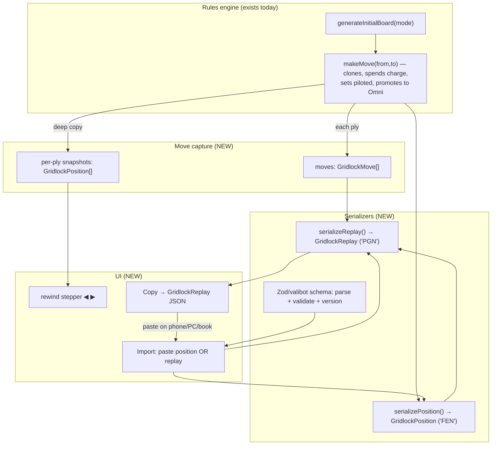

# Gridlock Replay & Position Format

> **Status:** IMPLEMENTED. Both layers ship in
> [format.ts](../../src/lib/chess/format.ts) (Zod-validated) and are wired into the app
> ([LocalGame.tsx](../../src/components/game/LocalGame.tsx)): position + replay
> serialize/parse, ply-by-ply rewind (scrub), Copy → JSON, file import/export, and
> resume-on-refresh. This document is the design record — passages still phrased as
> "proposal"/"plan" explain the rationale behind what was built.
> It specifies a lossless, portable format for a Gridlock Chess
> **position** and a full game **replay**, so a match can be rewound/backtracked
> anywhere — in the app while playing, or moved to another system, PC, or phone —
> the same two-layer idea chess.com uses (FEN for one position, PGN for the whole
> game). The encoding is **versioned JSON** (see §1 for why); a chess-style
> single-line text string is kept as an optional human-readable render in the
> Appendix, not the storage format.
>
> Every "Verified" claim cites the source file/line it was read from.

---

## 0. The two layers (read this first)

The most important design decision, and it mirrors chess.com exactly:

| Layer | Chess.com analog | Captures | Used for |
| --- | --- | --- | --- |
| **Position** (`GridlockPosition`) | FEN | **One** position, losslessly (every piece + every charge + turn + clocks + piloted flag) | Sharing/resuming a single position; the engine's input |
| **Replay** (`GridlockReplay`) | PGN | The **starting position + the ordered list of every move** | Rewinding/backtracking a whole game, step by step, on any device |

**Why both are required (verified):** a single position is a snapshot of *one* moment.
It cannot, by itself, step backward through a game — there is no "previous move" inside
a position. Chess.com's rewind (the ◀ ▶ buttons, and replaying a game on another
device) is powered by **PGN**, the move list, not by FEN. So to rewind a Gridlock game
you need the **move list**; to land on ply *N* you replay moves `1..N` from the starting
position (in the app, `replayTo(replay, N)` — see §6).

- **Rewind while playing** → seek to any ply via `replayTo(replay, N)` over the move list
  (§6). No per-ply snapshot stack is kept.
- **Rewind anywhere / other devices** → export the `GridlockReplay` JSON; any device
  re-imports and replays. A lone `GridlockPosition` exports/imports a single position.

### Architecture

> The full pipeline below — rules engine, move capture, serializers, rewind, copy/import —
> is **implemented** ([format.ts](../../src/lib/chess/format.ts),
> [LocalGame.tsx](../../src/components/game/LocalGame.tsx)). The `(NEW)` subgraph labels are
> historical (they mark what was added after the rules engine).



---

## 1. Why JSON, and why not a chess-style FEN text string

Real FEN/PGN earns its cramped one-glyph-per-square text grammar **only** because of a
50-year ecosystem: thousands of engines, databases, books, and sites already parse it.
Gridlock has **no external consumers today**. Without that ecosystem, a bespoke text
DSL means hand-writing a tokenizer, an escaping scheme, and custom error handling — to
buy interoperability that does not exist. That is cost without benefit (YAGNI).

A **versioned JSON schema** is the modern, lower-risk choice here:

- **Lossless and obvious.** Three numeric charge pools per piece are just an object:
  `{ "L": 10, "O": 0, "D": 0 }`. No single-digit packing hacks, no "charge = 10 is two
  digits" problem, no color-vs-archetype casing collisions. (Those were real open
  problems in the earlier FEN-text draft; JSON deletes them.)
- **Free parsing + validation.** `JSON.parse`/`stringify` ship everywhere; a
  Zod/valibot schema gives parse-time validation, type inference, and versioned
  migration in a few lines.
- **Maximally portable across devices** — JSON is the universal interchange format for
  phones, PCs, and servers, which is exactly the "rewind anywhere" requirement.

**The one thing JSON loses:** it is not pretty to print or transcribe by hand into a
book. That is a *display* concern, not a *storage* concern. If a human-typable string is
ever a real requirement, render a compact text form *from* the JSON (one-way), and never
parse the pretty string back. That render is specified in the **Appendix** and is
explicitly out of scope for v1.

**Design goals (all satisfied by JSON):** lossless · portable across devices · versioned ·
**generator-independent** (store the start position, never an RNG seed — the army
generator uses unseeded `Math.random()`, so a seed would rot the instant generation
changes; verified in [generator.ts](../../src/lib/chess/generator.ts)).

---

## 2. The state that MUST be captured (verified)

All items confirmed against the type model in [game.ts](../../src/types/game.ts) and the
move logic in [move.ts](../../src/lib/chess/move.ts) (wrapped by
[useGameState.ts](../../src/hooks/useGameState.ts)).

### 2.1 Per-square piece state
- **King** (`type: 'king'`) — color only. ([game.ts](../../src/types/game.ts#L60))
- **Pawn** (`type: 'pawn'`) — color; `hasMoved`; `enPassantVulnerable?`. ([game.ts](../../src/types/game.ts#L65))
  `hasMoved` is positionally derivable (a pawn off its home rank has moved). `enPassantVulnerable`
  is redundant with the position-level en-passant target. Recommend: store neither; derive both.
- **Anomaly** (non-omni) — color; `archetype`; `vectors {L,O,D}`; `isGridlocked`; `piloted?`. ([game.ts](../../src/types/game.ts#L72))
  `isGridlocked` is derivable (`L===0 && O===0 && D===0`). The **`piloted` flag is NOT derivable** and must be stored (see §3, Override).
- **Omni / Terminator** (`archetype: 'omni'`) — color; `vectors {shared}`; `isGridlocked`. ([game.ts](../../src/types/game.ts#L84))
  Only obtainable via pawn promotion (§3, Promotion). Starts with `shared: 8`.
- **Piece `id`** — every piece carries `id: string` ([game.ts](../../src/types/game.ts#L57)). It is a
  **runtime-only** handle: it drives React keys and framer-motion `layoutId` animation
  (per-game ids restart at `piece-1`). It is **not** game state and is **intentionally omitted**
  from the format. On import the renderer must **regenerate fresh unique ids** for every piece;
  reusing stale ids (or leaving them undefined) breaks animation and React reconciliation.
  This is a deliberate, documented exclusion — the format is lossless with respect to *game*
  state, not transient view handles.

### 2.2 Game-level state
- **Side to move** — `turn`. ([game.ts](../../src/types/game.ts#L113))
- **En passant target** — the square a pawn skipped, if any. Granted on a pawn double step in the move kernel. ([move.ts](../../src/lib/chess/move.ts#L106-L118))
- **Halfmove clock** — `halfmoveClock`; drives the fifty-move rule. Only ticks in the bare King-and-pawn endgame, because every Anomaly move spends a charge (irreversible) and resets it. ([game.ts](../../src/types/game.ts#L139), [useGameState.ts](../../src/hooks/useGameState.ts#L162), threshold [outcome.ts](../../src/lib/chess/outcome.ts#L20))
- **Fullmove number** — now a stored field of an exported position (`fullmove`, [format.ts](../../src/lib/chess/format.ts#L56)); still derivable from move count when replaying.
- **Repetition history** — `positionCounts`. ([game.ts](../../src/types/game.ts#L132)) Keyed by [repetitionKey](../../src/lib/chess/repetition.ts#L20). For a **replay** these are reconstructable by re-applying moves; for a **single exported position** they are genuinely unknowable and reset on import (documented limitation — §5).
- **Result / end reason** — belongs to a *finished game*, **not** to a position. A bare
  `GridlockPosition` does **not** carry it (a position is just a board + side-to-move +
  clocks; the outcome is recomputed by the rules engine, exactly as chess FEN has no
  result field). It lives only in replay `meta` (§5.2). The full vocabulary is `GameStatus`
  + `DrawReason` ([game.ts](../../src/types/game.ts#L98-L108)): statuses
  `checkmate · stalemate · resigned · gridlock-death · draw`, and for draws the reasons
  `repetition · gridlock · fifty-move`.

---

## 3. The special states the format must record (verified)

These are the Gridlock-specific mechanics the user asked the format to cover. Each is
read from code:

### 3.1 36 anomaly builds & ~5.95 billion openings
- **36 distinct starting builds**, **not 32** — machine-verified by `docs/dev/scripts/verify_balance.mjs`
  (`distinct builds: 36`), hardcoded as `ANOMALY_BUILDS = 36` in
  [WelcomeModal.tsx](../../src/components/game/modals/WelcomeModal.tsx#L60), and documented in
  [BalancedRandomGenerator.md](BalancedRandomGenerator.md). Breakdown: High 3×6 = 18,
  Hybrid 3×4 = 12, Balanced 3, Absolute 3×1 = 3 → **36**.
- **Openings:** Balanced mode (the only mode — an exact 24/23/23 uniform sampler) yields
  **5,950,517,760** distinct valid starting positions — from 743,855,490 valid armies × 8 king
  files, minus 326,160 same-color bishop-pair boards removed by the opposite-color bishop
  rule. Machine-verified by `docs/dev/scripts/verify_exact_balance.mjs` and `docs/dev/scripts/verify_bishop_rule.mjs`.
  (The retired two-mode/rejection-sampling design counted ~372B — see
  [BalancedRandomGenerator.md](BalancedRandomGenerator.md) for that history.)
- **Format impact:** the position must store each anomaly's `archetype` **and** its exact
  `{L,O,D}` charges, since the build is (archetype + distribution). 36 is the *starting*
  set; mid-game charge depletion makes the live per-piece state space far larger, which
  is exactly why the format stores raw charges rather than a build index.

### 3.2 Depleting charges per vector move
- Verified in [move.ts](../../src/lib/chess/move.ts#L121-L134): a non-omni
  anomaly move does `pool[vectorUsed] - 1`; an Omni does `pool.shared - 1`. The piece's
  `isGridlocked` is recomputed after every spend.
- **Which pool a move spends is derivable from `(from, to)`** — *not* something the replay
  strictly needs to store. Verified in [movement.ts](../../src/lib/chess/movement.ts#L90-L130):
  the three geometries are **disjoint** — leap (`getLeapMoves`), orthogonal
  (`getOrthogonalMoves`), and diagonal (`getDiagonalMoves`) never produce the same
  destination square, so any `(from, to)` maps to exactly one `VectorType`. (The Omni
  branch's `if (!moves.has(sq))` guards are defensive, not evidence of overlap.)
- **Format impact:** a position snapshot stores the *current* pools (mutable state). In a
  **replay**, charges are **derived** by re-applying moves and decrementing the (derivable)
  pool. The optional `vec` field on a move (§5.2) is therefore a **convenience/cross-check**
  (handy for the human-readable render and a cheap legality assertion), **not** a
  correctness requirement. The gridlock flag is likewise recomputed, never stored.

### 3.3 Override → Piloted Anomaly
- Verified in [move.ts](../../src/lib/chess/move.ts#L71-L90): the King steps
  onto a friendly anomaly; the host becomes `{ ...host, piloted: true }` and the King
  piece is consumed. No capture, **no charge spent on the boarding move**, irreversible.
  A piloted anomaly IS the royal piece — verified in [check.ts](../../src/lib/chess/check.ts#L8-L12):
  `isRoyal` returns true for `piloted`, and `findKing` locates it as the royal piece, so it
  carries every King-safety rule (Rulebook §6.1). *(The `piloted?` doc-comment in
  [game.ts](../../src/types/game.ts#L78-L82) now states this correctly — an earlier
  "visual-only / ignored by the movement engine" comment was stale and has since been fixed.)*
- **Format impact:** the position must carry a per-piece **`piloted` boolean** (the field the
  internal `repetitionKey` omits — §4; the portable `serializePosition` stores it). A replay
  move records an **`override` flag**; from/to plus that flag reconstructs the merge
  (king square → host square).

### 3.4 Gridlock
- A piece with `{L:0,O:0,D:0}` (or Omni `shared:0`) can never move again; an all-frozen
  board is a draw (`isTotalGridlock`, [outcome.ts](../../src/lib/chess/outcome.ts#L33-L54)).
- **Format impact:** *derive*, never store — the gridlock flag is a pure function of
  charges. The position stores charges; gridlock falls out.

### 3.5 Pawn promotion → Terminator (Omni) — deterministic, NOT a choice
- **Verified correction:** promotion is **automatic to Omni/Terminator**. In
  [move.ts](../../src/lib/chess/move.ts#L142-L160) the kernel auto-creates an Omni
  (`createOmniAnomaly`, `shared: 8`) when a pawn reaches the back rank. `promotionSquare` is
  never set non-null anywhere (grep-verified), so the `PromotionModal`/`promote()` selection
  path is effectively dead — the player does **not** pick among archetypes.
- **Format impact:** a replay move needs only a **`promotion` flag** (or `from/to` on the
  back rank). It does **not** need to record *which* archetype, because it is always
  Omni. *(This corrects an earlier draft that claimed the replay must store one of 11
  promotion choices — that was based on a false premise.)*

---

## 4. Existing serializers in the codebase (verified prior art)

| Function | Location | Captures | Limitation |
| --- | --- | --- | --- |
| `boardToFen` | [engine.ts](../../src/lib/chess/engine.ts#L66) | Board → fairy-chess FEN for Fairy-Stockfish | **Lossy by design.** One glyph per piece; **drops charge numbers**; omits EP/castling; a piloted anomaly becomes a plain `k`. Engine input only. |
| `getBoardLayoutCode` | [generator.ts](../../src/lib/chess/generator.ts#L124) | Back rank only: `archetype:LOD` per file | No pawns, no full board, no turn/EP, no piloted/omni handling. |
| `repetitionKey` | [repetition.ts](../../src/lib/chess/repetition.ts#L20) | Turn, EP target, every piece (`sq`+color+type, anomaly `archetype.L.O.D`, omni `o{shared}`) | Internal **repetition hash**, not portable, and deliberately **omits `piloted`**. The portable format below **does** encode `piloted`. |
| `serializePosition` / `serializeReplay` | [format.ts](../../src/lib/chess/format.ts#L56) / [format.ts](../../src/lib/chess/format.ts#L226) | The portable **Layer 1 position** and **Layer 2 replay** (§5) | Lossless, versioned, Zod-validated; **encodes `piloted`**. This is the storage / interchange format. |
| `StateSnapshot` | [protocol.ts](../../src/lib/net/protocol.ts#L21) | `board`, `turn`, `enPassantTarget?`, `mode`, `hostColor` — the existing whole-position restore (Uplink) | A JS object over the wire, **not portable text**; no clock/repetition metadata. Closest in-memory analog to `GridlockPosition`. |

**Restore-path caveat (verified):** `loadState` ([useGameState.ts](../../src/hooks/useGameState.ts#L263-L293))
hard-resets `positionCounts: {}` and `halfmoveClock: 0`. Any import/rewind that reuses it
silently breaks threefold-repetition and the fifty-move rule. A faithful position import
must restore those (replay import rebuilds them by re-applying moves — §5.3).

**Reuse note:** the move kernel clones the moved piece (`const moved = { ...board[from]! }`,
override host `{ ...host, piloted: true }`, charges reassigned to a *new* object) rather than
mutating shared piece objects in place — verified in
[move.ts](../../src/lib/chess/move.ts#L56-L160) (wrapped by `makeMove`). So retaining a
reference to a prior `GameState` does not get corrupted by a later move **today**. The
format/serializer should still deep-copy (or re-serialize) snapshots to stay robust against any future
in-place mutation — do not rely on this as a guarantee.

---

## 5. JSON schema (IMPLEMENTED)

> Built as Zod schemas in [format.ts](../../src/lib/chess/format.ts)
> (`gridlockPositionSchema` §5.1, `gridlockReplaySchema` §5.2). Field names are short to keep
> payloads small. Types mirror [game.ts](../../src/types/game.ts).

### 5.1 `GridlockPosition` — one lossless position (the "FEN")

```jsonc
{
  "v": 1,                       // schema version
  "turn": "white",              // "white" | "black"
  "enPassant": null,            // Square (e.g. "c6") | null
  "halfmoveClock": 0,
  "fullmove": 1,
  "board": {
    // key = square; value = piece. Empty squares are simply absent.
    "a1": { "t": "king", "c": "white" },
    "b1": { "t": "anomaly", "c": "white", "a": "highLeap", "v": { "L": 6, "O": 1, "D": 3 } },
    "c1": { "t": "anomaly", "c": "white", "a": "absLeap",  "v": { "L": 10, "O": 0, "D": 0 } },
    "d1": { "t": "anomaly", "c": "white", "a": "omni",     "v": { "shared": 8 } },
    "e3": { "t": "anomaly", "c": "white", "a": "highLeap", "v": { "L": 2, "O": 0, "D": 1 }, "piloted": true },
    "a2": { "t": "pawn", "c": "white" },
    "g8": { "t": "king", "c": "black" }
  }
}
```

Rules:
- `t`: `"king" | "pawn" | "anomaly"`. `c`: `"white" | "black"`.
- Anomaly: `a` = archetype key (`highLeap`…`absOrtho`, or `omni`); `v` = charges. Omni
  uses `{ "shared": n }`; all others use `{ "L", "O", "D" }`.
- `piloted: true` only on the one anomaly the King boarded (Override). Omitted when false.
- **Derived, never stored:** `isGridlocked` (from charges), pawn `hasMoved`
  (from rank), pawn `enPassantVulnerable` (from position `enPassant`).
- **Piece `id` is intentionally absent** (§2.1) — it is a transient view handle, not game
  state. The importer must mint fresh unique ids per piece.
- The numeric `10` is just a number here — no packing problem.

### 5.2 `GridlockReplay` — start position + every move (the "PGN")

```jsonc
{
  "v": 1,
  "meta": {
    "mode": "protocol-run-dry",     // optional string tag: "local" | "protocol-run-dry" | "uplink"
    "generationMode": "balanced",   // "pure" | "balanced"
    "players": { "white": "Cybored", "black": "You" },
    "result": "1-0",                // "1-0" | "0-1" | "1/2-1/2" | "*"
    "endReason": "checkmate",       // "checkmate"|"stalemate"|"resigned"|"gridlock-death"|"timeout"|"gridlock"|"repetition"|"fifty-move" (see §2.2)
    "createdAt": "2026-06-28T12:00:00Z"
  },
  "start": { /* a GridlockPosition (§5.1) — the randomized opening army */ },
  "moves": [
    { "from": "b1", "to": "e4", "vec": "O" },
    { "from": "d7", "to": "d5" },
    { "from": "a2", "to": "a4" },
    { "from": "e1", "to": "d2", "override": true },
    { "from": "g7", "to": "g8", "promotion": true },
    { "from": "f3", "to": "f4", "vec": "L", "capture": true, "check": true }
  ]
}
```

Move record (`GridlockMove`) — minimal; everything else is derived by replay:
- `from`, `to`: squares (required) — **these two alone fully determine the move**, including
  which charge pool is spent (§3.2: the L/O/D geometries are disjoint).
- `vec`: `"L" | "O" | "D"` — **optional, derivable** from `(from, to)`. Stored only as a
  human-readable convenience and a cheap legality cross-check; the replayer does **not**
  need it for correctness. Omitted for King/pawn moves and Override (boarding spends
  nothing). For an **Omni** it is purely cosmetic (the single `shared` pool is decremented
  regardless of direction). See open question §7.
- Optional flags, omitted when false: `capture`, `enPassant`, `override` (§3.3),
  `promotion` (§3.5 — always Omni, so no target needed), `check`, `checkmate`.
- **Not stored** (derived during replay): resulting charges, gridlock flags, repetition
  counts, halfmove clock, full board. The replayer recomputes them by applying the move
  through the same rules as `makeMove`.

### 5.3 Reconstruction model
- **Single position import:** load `GridlockPosition` directly. Repetition history and
  halfmove clock are unknowable from one position → reset (documented limitation).
- **Replay import / rewind to ply N:** start from `start`, apply `moves[0..N-1]` through
  the rules engine. This *derives* charges, gridlock, captures, repetition counts, and
  clocks exactly — nothing about derived state needs to be stored in the moves.

### 5.4 Validation
- Implemented with Zod: `gridlockPositionSchema` / `gridlockReplaySchema` in
  [format.ts](../../src/lib/chess/format.ts). `parse()` validates structure, enums (square
  names, archetype keys, colors), and version. An unknown `v` is rejected rather than guessed.

---

## 6. Rewind *while playing* (in-app scrub) — IMPLEMENTED

The shipped rewind uses **strategy (A) replay-from-start**: the game keeps a start-position
ref plus the ordered move list (a live `GridlockReplay`), and seeking to ply N calls
`replayTo(replay, N)` to re-apply `1..N` through the rules engine
([LocalGame.tsx](../../src/components/game/LocalGame.tsx#L696)). This *derives* charges,
gridlock, captures, and clocks exactly, so no per-ply snapshot stack is needed.

- **(A) Replay-from-start — chosen.** Re-apply `1..N` from `start`. Low memory; couples the
  stepper to the rules engine (acceptable — the move kernel is pure, §4).
- **(B) Per-ply snapshots — not used.** Would push a deep copy per move; unnecessary now that
  `replayTo` derives any ply on demand.

The **exportable** artifact for other devices is the `GridlockReplay` JSON
(`serializeReplay`), and import reads a `.json` replay via a file field
([MoveHistoryPanel.tsx](../../src/components/game/panels/MoveHistoryPanel.tsx#L30-L52)).

### What the Copy button produces (shipped)

Move History now offers **two** copies plus file import
([MoveHistoryPanel.tsx](../../src/components/game/panels/MoveHistoryPanel.tsx)):
a human-readable text render (with the starting layout prepended via
`renderPositionText(parseReplay(json).start)`), and **Copy → JSON**
(`getReplayJson` → `serializeReplay`) which is re-importable.

| | Plain-text copy | GridlockReplay JSON (Copy → JSON) |
| --- | --- | --- |
| Re-importable | No | Yes |
| Contains starting army | Yes (header) | Yes (`start`) |
| Charges / piloted | In header only | Yes (in `start`; derived per ply) |
| Rewind to ply N | No | Yes |
| Portable to phone/PC/book | Display | Yes (universal JSON) |

---

## 7. Resolved decisions (locked for Layer 2)

1. **Store `vec` as optional convenience.** It is fully derivable from `(from, to)` (§3.2),
   never required for correctness. **Decision:** keep `vec?` optional — written for non-omni
   anomaly moves as a human-readable cross-check, omitted for King/pawn/override and for
   Omni (where direction is cosmetic). The replayer ignores it for state; if present, it may
   assert it against the derived pool. Layer 1 already proved charges are reconstructable
   without it ([format.spec.ts](../../src/lib/chess/__tests__/format.spec.ts)).
2. **`endReason` enum = `GameStatus` (terminal) ∪ `DrawReason`.** Locked to
   `checkmate · stalemate · resigned · gridlock-death · repetition · gridlock · fifty-move`
   ([game.ts](../../src/types/game.ts#L98-L108)). `result` ∈ `"1-0" | "0-1" | "1/2-1/2" | "*"`.
   Lives only in replay `meta`, never in a bare position (§2.2).
3. **Reuse the `Square` union.** Layer 1 validates squares with a `[a-h][1-8]` regex cast to
   `Square` ([format.ts](../../src/lib/chess/format.ts)); Layer 2 reuses the same `square`
   schema for compile-time + parse-time safety. Decided.
4. **Position-only repetition reset is accepted.** A lone `GridlockPosition` resets
   repetition + halfmove clock (§5.3) — a documented, acceptable limitation. Exact
   threefold/fifty-move continuity requires a `GridlockReplay`, which rebuilds both by
   re-applying moves. Decided.

---

## 8. Implementation status

**Layer 1 — Position: ✅ DONE.**
1. ✅ `GridlockPosition` + Zod schema; `serializePosition()`/`parsePosition()`/`positionToBoard()`
   in [format.ts](../../src/lib/chess/format.ts).
2. ✅ Round-trip property test (100 random boards) — serialize→parse→rebuild preserves
   charges + `piloted` + turn/EP/clocks ([format.spec.ts](../../src/lib/chess/__tests__/format.spec.ts)).

**Layer 2 — Replay (the part that rewinds): ✅ DONE.**
3. ✅ `GridlockReplay` + `GridlockMove` schemas; moves captured as a structured list and
   rebuilt into history via the stepper ([LocalGame.tsx](../../src/components/game/LocalGame.tsx#L50)).
4. ✅ `serializeReplay()` / `parseReplay()` / `applyReplayMove()` / `replayTo()` — the replay
   stepper re-applies moves from `start` through the shared move kernel (§5.3).
5. ✅ In-app scrub rewind via `replayTo(replay, viewPly)` (§6) — replay-from-start (option A).
6. ✅ Move History "Copy" exports plain text **and** `GridlockReplay` JSON, plus `.json`
   file import ([MoveHistoryPanel.tsx](../../src/components/game/panels/MoveHistoryPanel.tsx)),
   and single-player games resume across a refresh from a persisted replay
   ([LocalGame.tsx](../../src/components/game/LocalGame.tsx#L380)).

---

## Appendix — optional human-readable text render (out of scope for v1)

If a chess-FEN-style single-line string is ever needed (e.g. to print in a book or type
by hand), render it **from** the JSON one-way; never parse it back. A possible shape,
mirroring FEN's ranks-8→1 layout but with explicit per-piece charges:

```
ranks 8→1, '/'-separated; per square: K/k, P/p, archetypeCode+charges, *=piloted
```

This is deliberately unspecified here — it is a presentation concern, and locking it now
would re-introduce exactly the packing/casing problems (charge "10", color vs code) that
choosing JSON avoided. Defer until there is a concrete requirement.

> Both layers are implemented (§8). Only the optional human-readable text render above
> remains deferred.
